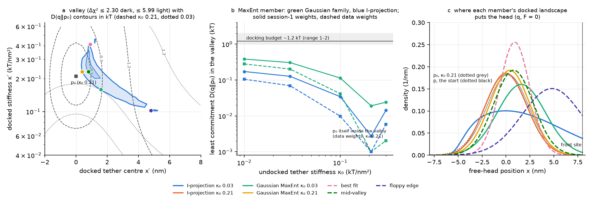
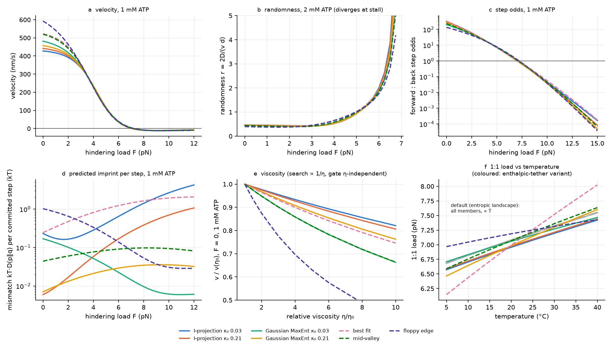

# PREDICTIONS: fixed before any comparison with the limit datasets

This file is Part B of session 2. It holds the predictions of the "state bet"
hypothesis for kinesin-1 neck-linker docking near the motor's limits. It was
committed **before** `analysis/part_c_confront.py`, the Part C comparison
script, was run for the first time; git history records the order. Nothing
below was changed after any comparison.

The numbers come from `results/part_b_valley.json` and
`results/part_b_limits.json`. The tables are printed by `analysis/make_tables.py`
into `results/tables_partB.md`, which holds every table in full. Figures:
`figures/fig5_valley.png` and `figures/fig6_limits.png`.

---

## 0. What went in, and what I had seen

**Constraints (the only data fitted).** Carter & Cross 2005 (C&C) give three
relations: the forward:back step ratio, and the mean dwell at 1 mM and at
10 µM ATP. Each is sampled at 3, 4, …, 9 pN (Part A, `analysis/v3fit.py`).
There are two weightings:
* session 1's assumed scatter: σ(ln dwell) 0.10, σ(ln ratio) 0.20;
* C&C's own plotted scatter: 0.20, 0.33.

The members in §2–§4 use session 1's weights.

**Fixed inputs, not fitted.** Each has its source.

| input | value | source |
|---|---|---|
| kT | 4.087 pN·nm (23 °C) | C&C temperature |
| water viscosity η₀ | 0.932 mPa·s | 23 °C |
| head diffusion | D = kT/(6πη₀·2.5 nm) = 93.1 nm²/µs (v1's 87.3 is the same formula at 4.114 pN·nm and 1 mPa·s) | Stokes–Einstein, 2.5-nm head (v1) |
| step | d = 8.2 nm | C&C |
| load on the head | F/2 | v1 |
| p, the head's distribution when docking starts | N(0.2 nm, 1/0.21 nm²) on [−8, 8] nm, tilted by the load | mean from Mickolajczyk 2015 (substep 8.4 nm − 8.2 nm); width from a worm-like-chain neck linker (Kutys 2010: L_p 0.7 nm, 28 residues × 0.364 nm, κ = 3/(2 L_p L) = 0.21 kT/nm²) |
| undocked reference p₀ | N(0, 1/κ₀), κ₀ bracket 0.01–0.30 kT/nm² | 0.01 and 0.03 from Guydosh & Block 2009 (±0.4 and ±1.7 pN move the free head through ~23 nm: κ ≈ 0.4/11.5 and 1.7/11.5 pN/nm = 0.008 and 0.036 kT/nm²); 0.21 (WLC, above); 0.30 a stiffer bound |
| docking budget | 1.2 kT (range 1–2) | Rice 2003, second-hand via Block 2007 and Xu 2021 (REPORT2 §0.4) |
| rest-of-cycle shape | two equal exponential stages (CV² = 1/2) | Mickolajczyk 2015: one rate-limiting transition in each of the one- and two-heads-bound states; Taniguchi 2005: two rate-limiting transitions in dwell histograms |
| temperature | enthalpies 18.3 (forward), 18.2 (backstep) k_BT₀ | Taniguchi 2005 Table 2 (the brief's default) |

**What I had seen before writing this.** All of Part 0: REPORT2 §0.5 lists
the key values of every limit dataset, and I had digitised their figures. I
had also seen the Part A check against Kondo 2023. These predictions are
therefore **not blind**, but no parameter was fitted to any of those datasets.
Five structural choices were made after seeing Part 0:
* the two-stage rest of cycle (above);
* Taniguchi's enthalpies. These make Taniguchi's zero-load rates **inputs**
  here, not tests.
* a viscosity-independent gate as the default, with the viscous gate as a variant;
* p from tracking;
* the load and ATP grids set to the datasets' conditions: 2 mM, 5 µM, 1.6 mM,
  4.2 µM, 10 µM, and −15 to +15 pN. The conditions were used, not the values.

---

## 1. Definitions

* **Position.** x (nm) is the free head's position relative to the bound head.
  The front site is at +8 nm, and the rear wall at −8 nm reflects.
* **Load tilt.** Under a hindering load F, every distribution is tilted by
  e^(−fx) with f = F/2kT.
* **Commitment** D(q‖p₀). q is the docked equilibrium ("the bet") and p₀ the
  undocked tether ("no bet"). D(q‖p₀) is the least free energy the bet can
  cost when docking only restricts the head (V ≥ 0):
  −ln⟨e^(−V)⟩_p₀ = D(q‖p₀) + ⟨V⟩_q ≥ D(q‖p₀).
* **MaxEnt member.** The member of the valley (defined in §2) with the
  smallest D(q‖p₀), for each κ₀. Two families are searched:
  - the Gaussian tether (κ′, x′);
  - the I-projection q ∝ p₀·exp(−λ₁e^(−f₁x) − λ₂e^(−f₂x)), with f at 3 and 9 pN.
    This is the MaxEnt family, because the capture rate's load dependence
    measures ⟨e^(−fx)⟩_q.
* **Imprint** kT·D(p‖q). This is the free energy dissipated when a head
  distributed as p relaxes in the docked landscape after the quench.
  - **Primary accounting:** one quench per committed step (forward or back),
    i.e. per ATP hydrolysed. An ATP that binds and leaves (the clock) closes a
    loop in which x-independent binding cannot dissipate: its quench and
    reverse quench are not an independent cost.
  - **Upper bound:** one quench at every ATP binding, futile ones included.
  - Also reported: per net forward step, and per second.
* **Kinetic observables.**
  - Velocity v, and randomness r = 2D_eff/(v·d) (steady state, renewal–reward).
  - Odds: P(forward)/P(back) per committed step. The 1:1 load, where the odds
    are 1, is where v = 0.
  - Dwell: the time between successive steps of either direction. The mean
    and the CV are reported.
* **Viscosity.**
  - The search's D scales as 1/η.
  - The gate is η-independent by default (a conformational gate); the variant
    has it ∝ 1/η.
  - The clock, ATP binding and the rest of the cycle do not change.
* **Temperature.**
  - The docked tether, barrier and start keep their shape in kT units
    (an "entropic landscape").
  - D follows T/η_water(T), whose enthalpy is 7.93 k_BT₀. A prefactor carries
    the remaining 10.37 k_BT₀, so that k_f(0) has Taniguchi's 18.3.
  - The gate has 18.2. The clock, k_on and the rest of the cycle have 18.3
    (an assumption).
  - Variants:
    - rest of cycle at 10 and 26.2 k_BT₀ (Hong 2016's velocity Ea);
    - an **enthalpic tether**, in which every stiffness is fixed in pN/nm, so
      κ/kT scales as T₀/T.

---

## 2. B.1–B.2: the valley, the MaxEnt member, the budget

**The valley.** All docked tethers (κ′, x′) whose C&C χ² is within Δχ² of the
best fit. Every other v3 parameter is refitted at each point (the barrier
B ≥ 0, the gate k_b0 and δ_b, the clock k_c, k_on, the rest T).

| weights | χ²_min (21 points) | 68% region: κ′ range, x′ range | 95% region: κ′ range, x′ range |
|---|---|---|---|
| session 1 σ = (0.1, 0.2) | 16.55 | (0.202, 0.348), (0.8, 1.2) nm | (0.102, 0.457), (0.4, 5.2) nm |
| data σ = (0.2, 0.33) | 4.33 | (0.102, 0.457), (0.4, 5.2) nm | (0.059, 0.524), (0.0, 8.0) nm |

The 95% valley is a curved ridge. It runs from stiff tethers centred near the
bound head (κ′ ≈ 0.4, x′ ≈ 1 nm, barrier B = 0) to floppy tethers parked
forward (κ′ ≈ 0.1, x′ ≈ 5 nm, B ≈ 11 kT). Two landscape parameters describe it
at the data's precision. The binding barrier trades off against the tether
along the ridge, so (κ′, x′) alone do not fix the landscape: B moves with
them.

**The MaxEnt member across the κ₀ bracket (95% valley):**

| weights | κ₀ | no bet (q = p₀): Δχ² | Gaussian member (κ′, x′) | D(q‖p₀) | I-projection (λ₁, λ₂) | D(q‖p₀) | valley D range | affordable fraction |
|---|---|---|---|---|---|---|---|---|
| session1 | 0.01 | 83.8 | (0.139, 2.30) | 0.384 | (−0.0218, 0.0058) | 0.172 | 0.40–0.88 | 1.00 |
| session1 | 0.03 | 77.1 | (0.159, 1.60) | 0.306 | (−0.0193, 0.0052) | 0.127 | 0.32–0.73 | 1.00 |
| session1 | 0.1 | 49.1 | (0.195, 0.80) | 0.114 | (−0.0115, 0.0031) | 0.034 | 0.12–1.02 | 1.00 |
| session1 | 0.21 | 18.2 | (0.232, 0.40) | 0.019 | (−0.0052, 0.0014) | 0.003 | 0.02–1.94 | 0.88 |
| session1 | 0.3 | 88.7 | (0.304, 0.40) | 0.024 | (0.2078, 0) | 0.014 | 0.02–2.81 | 0.75 |
| data | 0.01 | 23.3 | (0.110, 1.90) | 0.281 | (−0.0069, 0.0019) | 0.105 | 0.29–0.95 | 1.00 |
| data | 0.03 | 21.4 | (0.117, 1.50) | 0.202 | (−0.0058, 0.0016) | 0.069 | 0.21–1.04 | 1.00 |
| data | 0.1 | 13.7 | (0.149, 0.50) | 0.042 | (−0.0026, 0.0007) | 0.010 | 0.04–1.75 | 0.84 |
| data | 0.21 | **5.0** | (0.209, 0.00) | 0.000 | (0, 0) | 0.000 | 0.00–3.18 | 0.57 |
| data | 0.3 | 26.2 | (0.274, 0.00) | 0.002 | (0.1262, 0) | 0.006 | 0.00–4.46 | 0.47 |

Results B.1–B.2. These use only the constraint data.

**R1. Is a bet needed?**
* Under session 1's weights, yes at every κ₀: the undocked tether alone
  misses C&C by Δχ² = 18–89.
* Under C&C's own scatter, the undocked tether alone fails for every κ₀
  except the worm-like-chain value 0.21, where it is **inside** the 95%
  valley (Δχ² 5.05 < 5.99). So whether C&C's arrival times require a bet at
  all depends on the undocked tether's stiffness and on the error model.

**R2. How much commitment.** The least commitment that reproduces the arrival
times is small:
* at most 0.38 kT in the Gaussian family;
* at most 0.17 kT in the I-projection family. Wherever p₀ is at least as
  floppy as the valley (κ₀ ≤ 0.21), this beats the Gaussian member by
  2–7× at the same fit. At κ₀ = 0.3 the two are comparable (data weights:
  Gaussian 0.002, I-projection 0.006).
* Both are largest for a floppy p₀ and near zero for κ₀ ≈ 0.21–0.3.
* Every member found is a valid member of the valley, so these numbers are
  **upper bounds** on the least commitment over all landscapes that fit.
  The I-projection family is MaxEnt only if the data fixed exactly
  ⟨e^(−f_k x)⟩_q at two loads. They do not: they fix capture rates at seven
  loads through a map that also involves the barrier and the start.

**R3. Where the budget cuts.**
* The ~1.2 kT docking budget never binds at the MaxEnt member.
* For κ₀ ≤ 0.1 (session-1 weights) the whole valley is affordable.
* For κ₀ ≥ 0.21 the budget removes the forward-parked end of the valley:
  - session-1 weights: docked centres x′ ≥ 4.0 nm (κ₀ 0.21) or x′ ≥ 3.2 nm
    (κ₀ 0.30);
  - data weights: x′ ≥ 3.6 nm (κ₀ 0.21) or x′ ≥ 2.8 nm (κ₀ 0.30).

**R4. More parameters?**
* Two landscape parameters fit the data. But the MaxEnt member is not in the
  Gaussian family: the I-projection family, two λ's in the tilt basis, finds
  lower commitment at the same fit.
* In that family the MaxEnt bet is **a soft rear wall**, not a forward
  shift. It suppresses the head's excursions behind x ≈ −4 nm (κ₀ 0.03) or
  −5 nm (κ₀ 0.21): the potential reaches 0.3 kT there and ~9 kT at −8 nm.
  Those are the positions that a hindering load, through the tilt e^(−fx),
  weights most.
* The I-projection search used 24 directions in (λ₁, λ₂), 15° apart, so its D
  is an upper bound on the family minimum, within that angular resolution.

**The seven members carried into the predictions** (session-1 weights; the
two I-projection members are refitted with λ fixed):

| member | landscape | q mean, SD (nm) | Δχ² | B (kT) | k_b0 (s⁻¹) | δ_b (nm) | k_c (s⁻¹) | k_on (µM⁻¹s⁻¹) | T (ms) | D(q‖p₀), κ₀ 0.21 / 0.03 |
|---|---|---|---|---|---|---|---|---|---|---|
| I-projection, κ₀ 0.03 | p₀(0.03) × soft rear wall | 1.17, 3.33 | 5.63 | 8.07 | 10.26 | 0.81 | 47.5 | 0.89 | 17.6 | 0.459 / 0.127 |
| I-projection, κ₀ 0.21 | p₀(0.21) × soft rear wall | 0.06, 2.12 | 5.85 | 4.83 | 9.36 | 0.77 | 48.2 | 0.91 | 17.0 | 0.003 / 0.391 |
| Gaussian MaxEnt, κ₀ 0.03 | κ′ 0.159, x′ 1.60 nm | 1.56, 2.45 | 5.46 | 8.28 | 7.02 | 0.63 | 54.1 | 1.01 | 15.1 | 0.276 / 0.306 |
| Gaussian MaxEnt, κ₀ 0.21 | κ′ 0.232, x′ 0.40 nm | 0.40, 2.08 | 5.57 | 5.37 | 8.36 | 0.71 | 50.2 | 0.94 | 16.3 | 0.019 / 0.409 |
| best fit | κ′ 0.410, x′ 0.91 nm | 0.91, 1.56 | 0.00 | 0.00 | 6.42 | 0.58 | 57.6 | 1.07 | 14.2 | 0.178 / 0.676 |
| mid-valley | κ′ 0.232, x′ 0.80 nm | 0.80, 2.07 | 1.76 | 6.52 | 6.17 | 0.57 | 58.0 | 1.08 | 14.0 | 0.069 / 0.417 |
| floppy edge | κ′ 0.102, x′ 4.80 nm | 3.93, 2.49 | 5.77 | 11.25 | 4.43 | 0.41 | 69.9 | 1.30 | 11.1 | 1.723 / 0.566 |

Figure 5 shows:
* (a) the valley, with D(q‖p₀) contours;
* (b) the MaxEnt commitment against κ₀ and the budget;
* (c) q for every member.

---

## 3. B.3: predictions near the limits

All at 23 °C unless stated. Ranges are over the seven members. The **MaxEnt
members** are the four I-projection and Gaussian MaxEnt rows.

### 3.1 Load: through and past stall (1 mM and 10 µM; C&C's conditions)

| member | v(0) | v(4) | v(6) | v(7) | v(10) nm/s | 1:1 load (pN) | odds(4) | odds(7) | odds(10) |
|---|---|---|---|---|---|---|---|---|---|
| I-projection, κ₀ 0.03 | 428 | 236 | 35.3 | 0.5 | −10.3 | 7.03 | 17.5 | 1.03 | 0.045 |
| I-projection, κ₀ 0.21 | 442 | 235 | 35.8 | 0.8 | −10.4 | 7.04 | 17.3 | 1.05 | 0.040 |
| Gaussian MaxEnt, κ₀ 0.03 | 482 | 232 | 37.9 | 2.3 | −11.1 | 7.12 | 17.1 | 1.13 | 0.038 |
| Gaussian MaxEnt, κ₀ 0.21 | 457 | 234 | 36.8 | 1.5 | −10.7 | 7.08 | 17.2 | 1.08 | 0.038 |
| best fit | 522 | 229 | 35.0 | 2.6 | −11.0 | 7.15 | 16.5 | 1.15 | 0.057 |
| mid-valley | 520 | 230 | 36.8 | 2.8 | −11.2 | 7.15 | 16.7 | 1.17 | 0.045 |
| floppy edge | 593 | 227 | 39.4 | 4.2 | −12.0 | 7.22 | 16.6 | 1.26 | 0.039 |

* **Superstall (1 mM).** The velocity is most negative near 9–10 pN
  (−10 to −12 nm/s) and returns toward zero: −5 to −8 nm/s at 14 pN.
* **Assisting loads.** The velocity saturates by −5 pN at 437–675 nm/s, only
  2–14% above v(0) (at most 16% at −10 pN).
* **10 µM.**
  - v(0) = 62–82 nm/s, v(4) = 35–36, v(6) = 5.7–6.4.
  - Superstall velocity −1.7 to −2.0 nm/s at 10 pN.
  - **The odds at 10 µM equal the odds at 1 mM at every load.** In v3 the race
    begins after ATP binds, so [ATP] cannot enter it. The 1:1 load is the same
    7.0–7.2 pN at both concentrations.

### 3.2 Randomness (the conditions of Visscher 1999 and Block 2003)

| member | 2 mM: r(1) | r(3) | r(4) | r(5) | r(5.5) | r(5.75) | r(6) | 1.6 mM: r(−8…−2) | r(0) | r(4) | r(4.75) | 4.2 µM: r(0) | r(4.75) |
|---|---|---|---|---|---|---|---|---|---|---|---|---|---|
| I-projection, κ₀ 0.03 | 0.46 | 0.43 | 0.52 | 0.93 | 1.32 | 1.60 | 2.00 | 0.46 | 0.46 | 0.52 | 0.79 | 0.89 | 1.18 |
| I-projection, κ₀ 0.21 | 0.45 | 0.42 | 0.53 | 0.94 | 1.31 | 1.58 | 1.96 | 0.46 | 0.46 | 0.53 | 0.80 | 0.89 | 1.18 |
| Gaussian MaxEnt, κ₀ 0.03 | 0.43 | 0.42 | 0.56 | 0.95 | 1.29 | 1.52 | 1.85 | 0.46 | 0.44 | 0.56 | 0.82 | 0.90 | 1.18 |
| Gaussian MaxEnt, κ₀ 0.21 | 0.44 | 0.42 | 0.54 | 0.94 | 1.30 | 1.56 | 1.91 | 0.46 | 0.45 | 0.54 | 0.81 | 0.89 | 1.18 |
| best fit | 0.43 | 0.41 | 0.58 | 1.01 | 1.36 | 1.60 | 1.93 | 0.46 | 0.44 | 0.58 | 0.87 | 0.89 | 1.20 |
| mid-valley | 0.42 | 0.41 | 0.58 | 0.99 | 1.32 | 1.55 | 1.87 | 0.46 | 0.44 | 0.58 | 0.86 | 0.89 | 1.19 |
| floppy edge | 0.38 | 0.45 | 0.65 | 1.02 | 1.30 | 1.49 | 1.76 | 0.43–0.46 | 0.39 | 0.65 | 0.91 | 0.91 | 1.18 |

**Randomness against [ATP]** (Visscher Fig. 4a loads; full table in
`results/tables_partB.md`):
* **At 1.05 pN** r is non-monotonic:
  - 0.98–1.00 at 1 µM;
  - a minimum of 0.32–0.34 at 150–300 µM;
  - back up to 0.39–0.47 at 5 mM.
* **At 3.59 pN:** 1.06–1.07 at 1 µM, falling to a minimum of 0.42–0.54 near
  300 µM, then 0.46–0.55 at 5 mM.
* **At 5.69 pN:** 1.44–1.73, with hardly any dependence on [ATP].

The randomness diverges at the 1:1 load (v → 0 with finite diffusion). That
is structural: every model with backsteps does it.

### 3.3 Dwells (1 mM)

| member | mean dwell 0 / 4 / 7 / 8 / 10 / 12 pN (ms) | dwell CV 0 / 4 / 7 / 12 pN |
|---|---|---|
| I-projection, κ₀ 0.03 | 19.0 / 31.0 / 221 / 384 / 731 / 1118 | 0.66 / 0.57 / 0.92 / 0.98 |
| I-projection, κ₀ 0.21 | 18.5 / 31.1 / 223 / 387 / 725 / 1084 | 0.65 / 0.57 / 0.92 / 0.98 |
| Gaussian MaxEnt, κ₀ 0.03 | 16.9 / 31.4 / 222 / 385 / 687 / 960 | 0.64 / 0.60 / 0.93 / 0.98 |
| Gaussian MaxEnt, κ₀ 0.21 | 17.8 / 31.2 / 222 / 387 / 711 / 1034 | 0.65 / 0.58 / 0.92 / 0.98 |
| best fit | 15.6 / 31.7 / 223 / 373 / 664 / 922 | 0.65 / 0.61 / 0.93 / 0.98 |
| mid-valley | 15.6 / 31.7 / 223 / 379 / 666 / 910 | 0.64 / 0.62 / 0.93 / 0.98 |
| floppy edge | 13.6 / 32.0 / 223 / 381 / 632 / 797 | 0.59 / 0.68 / 0.95 / 0.99 |

* **Before a backstep vs before a forward step.** In v3 the two dwells are the
  same distribution at every load: the ratio of means is 1 and the shapes are
  identical. The exponential race makes the winner independent of the race
  time, and the rest of the cycle precedes both.
* **Shape.** A lag of about the rest time (~15 ms), then a near-exponential
  tail:
  - near stall, CV 0.92–0.95, i.e. 1/CV² = 1.1–1.2 rate-limiting steps;
  - at low load, CV 0.55–0.66, i.e. 2.3–3.3 steps.
* **The mean superstall dwell keeps growing with load.** It is 0.63–0.73 s at
  10 pN and 0.8–1.1 s at 12 pN. The gate slows under load (δ_b = 0.4–0.8 nm,
  fitted at 3–9 pN), and past stall the dwell is ≈ 1/k_b(F).
  This is a prediction about the gate, not about the bet.

### 3.4 Viscosity (Sozański's conditions: unloaded, 1 mM)

v(η)/v(η₀):

| member | gate | 1.5 | 2 | 3 | 5 | 6 | 8 | 10 (η/η₀) |
|---|---|---|---|---|---|---|---|---|
| I-projection, κ₀ 0.03 | η-independent | 0.99 | 0.98 | 0.95 | 0.91 | 0.89 | 0.86 | 0.82 |
| I-projection, κ₀ 0.21 | η-independent | 0.99 | 0.97 | 0.95 | 0.90 | 0.88 | 0.84 | 0.81 |
| Gaussian MaxEnt, κ₀ 0.03 | η-independent | 0.97 | 0.95 | 0.90 | 0.82 | 0.78 | 0.72 | 0.66 |
| Gaussian MaxEnt, κ₀ 0.21 | η-independent | 0.98 | 0.97 | 0.94 | 0.88 | 0.85 | 0.81 | 0.76 |
| best fit | η-independent | 0.98 | 0.96 | 0.93 | 0.87 | 0.84 | 0.79 | 0.75 |
| mid-valley | η-independent | 0.97 | 0.95 | 0.90 | 0.82 | 0.78 | 0.72 | 0.66 |
| floppy edge | η-independent | 0.93 | 0.87 | 0.78 | 0.63 | 0.58 | 0.49 | 0.42 |

* **The ∝ 1/η gate variant** slows the motor slightly **less** (0.66–0.94 at
  5η₀), because the backsteps slow too.
* **No member stops below 10η₀ at zero load.** At F = 0 the search
  (k_f(0) = 600–3200 s⁻¹) is far faster than the clock (47–70 s⁻¹), so a
  5–10× slower search only lengthens the step.
* **Under 3 pN of load** viscosity bites harder: v(5η₀)/v(η₀) = 0.30–0.49 and
  v(10η₀)/v(η₀) = 0.14–0.26 (`part_b_limits.json`, `viscosity`, F = 3).

### 3.5 Temperature (5–40 °C, 1 mM)

| | 5 °C | 15 °C | 23 °C | 30 °C | 40 °C |
|---|---|---|---|---|---|
| 1:1 load, default (all members within 0.01 pN) | 6.68 | 6.95 | 7.15 | 7.32 | 7.55 |
| 1:1 load, enthalpic-tether variant (range over members) | 6.15–6.97 | 6.72–7.12 | 7.03–7.23 | 7.19–7.52 | 7.42–8.02 |
| v at 0 pN (nm/s) | 131–181 | 257–356 | 428–593 | 653–904 | 1155–1597 |
| v at 5 pN (nm/s), default | 24–26 | 57–62 | 109–117 | 184–198 | 367–394 |
| v at 5 pN, rest of cycle at 10 / 26.2 k_BT₀ | 26–28 / 21–23 | 60–66 / 54–58 | 109–117 | 174–184 / 192–210 | 314–331 / 408–457 |
| r at 5 pN | 1.17–1.24 | 1.03–1.09 | 0.93–1.01 | 0.86–0.96 | 0.78–0.90 |
| odds at 5 pN | 5.1–5.8 | 6.2–7.0 | 7.1–7.9 | 7.8–8.6 | 8.8–9.6 |
| dwell CV at 5 pN | 0.74–0.84 | 0.71–0.82 | 0.69–0.80 | 0.67–0.79 | 0.65–0.77 |

* **The 1:1 load scales with absolute temperature** in the default,
  identically for every member (35 °C/15 °C = 1.070). (The 23 °C column
  reproduces §3.1 to within 0.3%; kT there is k_B·296.15 K = 4.0888 against
  4.087 pN·nm.) This follows from the
  entropic landscape and Taniguchi's near-equal enthalpies. It is not a
  property of any member.
* Over Taniguchi's range (7–35 °C) the 1:1 load rises ≈ 10%, 6.7 → 7.4 pN.

### 3.6 The imprint (mismatch cost)

**At F = 0 (kT per committed step), and its sensitivity to p with q held
fixed:**

| member | D(p‖q) | p mean −1.8 nm | p mean +2.2 nm | p SD 3.0 nm | p = undocked equilibrium, κ₀ 0.03 |
|---|---|---|---|---|---|
| I-projection, κ₀ 0.03 | 0.232 | 0.646 | 0.270 | 0.209 | 0.953 |
| I-projection, κ₀ 0.21 | 0.006 | 0.435 | 0.489 | 0.167 | 0.982 |
| Gaussian MaxEnt, κ₀ 0.03 | 0.169 | 0.929 | 0.046 | 0.184 | 0.582 |
| Gaussian MaxEnt, κ₀ 0.21 | 0.007 | 0.556 | 0.369 | 0.154 | 0.824 |
| best fit | 0.244 | 1.624 | 0.459 | 0.725 | 2.130 |
| mid-valley | 0.044 | 0.777 | 0.223 | 0.192 | 0.870 |
| floppy edge | 1.021 | 2.163 | 0.302 | 0.934 | 1.127 |

The ±2 nm columns are the label offset (brief); SD 3.0 nm is the spread of
Mickolajczyk's substep sizes, an upper bound on p's width.

**Against load (1 mM):**

| member | per committed step at 0 / 2 / 4 / 6 / 7 / 8 / 10 / 12 pN | per net step at 2 / 6 pN | per second at 0 / 2 / 6 pN | upper bound per step at 2 / 6 pN |
|---|---|---|---|---|
| I-projection, κ₀ 0.03 | 0.232 / 0.165 / 0.283 / 0.642 / 0.965 / 1.407 / 2.646 / 4.231 | 0.168 / 1.38 | 12.2 / 8.1 / 5.9 | 0.177 / 3.24 |
| I-projection, κ₀ 0.21 | 0.006 / 0.017 / 0.058 / 0.168 / 0.261 / 0.382 / 0.698 / 1.068 | 0.017 / 0.35 | 0.3 / 0.8 / 1.5 | 0.018 / 0.87 |
| Gaussian MaxEnt, κ₀ 0.03 | 0.169 / 0.101 / 0.052 / 0.023 / 0.014 / 0.010 / 0.006 / 0.006 | 0.104 / 0.04 | 10.0 / 5.3 / 0.2 | 0.116 / 0.13 |
| Gaussian MaxEnt, κ₀ 0.21 | 0.007 / 0.013 / 0.021 / 0.029 / 0.032 / 0.035 / 0.035 / 0.032 | 0.014 / 0.06 | 0.4 / 0.7 / 0.3 | 0.015 / 0.16 |
| best fit | 0.244 / 0.472 / 0.814 / 1.229 / 1.439 / 1.635 / 1.935 / 2.066 | 0.484 / 2.52 | 15.6 / 26.5 / 10.8 | 0.541 / 7.89 |
| mid-valley | 0.044 / 0.060 / 0.077 / 0.091 / 0.095 / 0.097 / 0.094 / 0.082 | 0.062 / 0.18 | 2.8 / 3.3 / 0.8 | 0.070 / 0.58 |
| floppy edge | 1.021 / 0.649 / 0.335 / 0.139 / 0.085 / 0.053 / 0.031 / 0.029 | 0.673 / 0.26 | 74.9 / 38.0 / 1.2 | 0.871 / 1.06 |

**The imprint against hidden dissipation.** The comparison value is Ariga's
figure from REPORT2 §0.2: ≈ 16 kT per step at 2 pN, whose uncertainty is not
known.
* At 2 pN the imprint is 0.013–0.165 kT per committed step for the MaxEnt
  members (0.1–1.0% of 16 kT). For every member it is at most 0.65 kT (4%).
* Allowing the ±2 nm label offset (evaluated at F = 0), the MaxEnt members
  reach up to 0.93 kT (6%).
* Per second at 2 pN: 0.7–8.1 kT/s (MaxEnt members), against
  ≈ 16 kT × 49–59 steps/s ≈ 780–940 kT/s of hidden dissipation, at the
  model's stepping rates.

**The model's own totals (1 mM; Δμ = 20.5 kT per ATP).**

| | 2 pN | 6 pN |
|---|---|---|
| total dissipation per net forward step | 17.0–17.3 kT | 26–32 kT |
| TUR bound 2/r from the model's randomness | 4.8–5.4 kT | 1.00–1.14 kT |

So in the model the TUR bound captures ~30% of the total at 2 pN and 3–4% at
6 pN: it goes slack toward stall. The imprint per net step at 2 pN is at most
0.67 kT, below the TUR bound, so the TUR cannot isolate it.

### 3.7 Differences in which chemistry cancels

Both are in kT per committed step. Each assumes the ATPase chemistry
(Δμ, the chemical free-energy drops) is the same in the two conditions compared.

* **Between loads**, Δ = imprint(6 pN) − imprint(2 pN), at 1 mM:
  - MaxEnt members −0.08 to +0.48;
  - all members −0.51 to +0.76.
  - The sign depends on the member: the imprint rises toward stall for the
    I-projection members and falls for the Gaussian MaxEnt κ₀ 0.03 and the
    floppy edge.
* **WT against a docking-abolished mutant.** The mutant is defined as q = p₀
  (κ₀ 0.21), with p unchanged: Δ = D(p‖q) − D(p‖p₀).
  - MaxEnt members +0.009 to +0.161 at 2 pN and +0.002 to +0.23 at 0 pN.
  - All members up to +0.65 at 2 pN.
  - With a floppy p₀ (κ₀ 0.03) the sign is **negative**: −0.12 to −0.59 at
    0–2 pN for every member except the floppy edge. p, which is narrower than
    p₀, would then dissipate more on relaxing to p₀ than to q. That case is
    internally inconsistent (p should equal p₀ before docking) and is shown
    only as a bracket.

---

## 4. B.4: which features discriminate?

"Precision" is my estimate of what one condition in a good single-molecule
dataset achieves. They are guesses, taken from typical error bars in the
folder's figures, **not** from agreement with any value.

| feature | range over the 7 members | MaxEnt members | spread / precision |
|---|---|---|---|
| v at 6 pN (nm/s) | 35.0–39.4 | 35.3–37.9 | 4.4 / 15 = 0.3 |
| 1:1 load (pN) | 7.03–7.22 | 7.03–7.12 | 0.20 / 0.3 = 0.7 |
| r at 5 pN, 1 mM | 0.93–1.02 | 0.93–0.95 | 0.08 / 0.06 = 1.4 |
| r at 5.75 pN, 1 mM | 1.49–1.60 | 1.52–1.60 | 0.11 / 0.10 = 1.1 |
| ln odds at 10 pN | −3.28 to −2.87 | −3.28 to −3.11 | 0.42 / 0.3 = 1.4 |
| dwell CV at 7 pN | 0.917–0.948 | 0.917–0.929 | 0.03 / 0.05 = 0.6 |
| **v(5η₀)/v(η₀), unloaded** | **0.63–0.91** | **0.82–0.91** | **0.28 / 0.05 = 5.6** |
| 1:1 load 35 °C / 15 °C (default) | 1.070 (all) | 1.070 | 0 |
| imprint per step at 2 pN (kT) | 0.013–0.649 | 0.013–0.165 | 0.64 / ~1 (guess) = 0.6 |
| imprint difference 6 − 2 pN (kT) | −0.51 to +0.76 | −0.08 to +0.48 | 1.27 / ~1 (guess) = 1.3 |

Findings of B.4:
* **Near stall the curves do not discriminate.** Near stall, v, the 1:1 load,
  r, the odds and the dwell CV move together across the valley. No member
  differs from another by more than ~1.4× a realistic precision.
  - The C&C constraints fix the character of these curves; which docked
    landscape carries them does not.
  - In this model **the bet is not visible in the near-stall kinetics**.
* **The unloaded viscosity response discriminates, but it tracks the wrong
  quantity.** It is the only feature where members differ by several times
  the precision (0.63–0.91 at 5η₀). It follows the unloaded capture rate
  k_f(0) = 600–3200 s⁻¹, which the 3–9 pN constraint window leaves free. It
  separates the floppy, forward-parked edge from the rest. It is not
  specific to the bet (commitment), although the I-projection members are
  the least viscosity-sensitive (0.90–0.91).
* **Temperature needs an extra assumption to discriminate.** It separates
  members only if the tether is enthalpic, an assumption rather than a
  consequence of the hypothesis.
* **The imprint varies but stays small.** It varies ~100-fold across the
  valley (0.006–1.0 kT at F = 0). Everywhere at ≤ 2 pN it stays below 1 kT,
  and below ~0.2 kT for the MaxEnt members with p as tracked.

---

## 5. The predictions, numbered

Each gives the condition, the predicted range (over the seven members; the
MaxEnt members in brackets), and what a contradiction would refute:
* **[v3]** marks a test of the kinetic model (diffusive front search plus a
  backstep gate), shared by all members;
* **[bet]** marks a test specific to the hypothesis.

1. **P1 [v3]. Force–velocity through stall, 1 mM, 23 °C (full-length KHC as
   in C&C).**
   - v(6 pN) = 35–39 nm/s.
   - v = 0 at 7.03–7.22 pN.
   - Superstall velocity most negative near 9–10 pN (−10 to −12 nm/s), then
     back toward 0 (−5 to −8 nm/s at 14 pN).
   - Saturation under assisting load by −5 pN, with v(−10)/v(0) ≤ 1.16.
2. **P2 [v3]. [ATP] does not move the odds.** The forward:back odds at 10 µM
   equal those at 1 mM at every load, so the 1:1 load is 7.0–7.2 pN at both.
   Refuted if the 10 µM 1:1 load differs from the 1 mM one by more than the
   counting error.
3. **P3 [v3]. Randomness at 2 mM against load.**
   - r = 0.38–0.46 up to 3 pN.
   - 0.52–0.65 at 4 pN, 0.93–1.02 at 5 pN, 1.29–1.36 at 5.5 pN, 1.49–1.60 at
     5.75 pN.
   - Diverges at the 1:1 load.
   - At 1.6 mM with assisting loads, r = 0.43–0.46 from −8 to −2 pN.
   - Refuted by points outside these ranges by more than 2 s.e.m. For squid
     kinesin (Visscher), compare only if its stall force is close to 7 pN.
4. **P4 [v3]. Randomness against [ATP].**
   - At 1.05 pN, a minimum of 0.32–0.34 near 150–300 µM, rising to 0.39–0.47
     at 5 mM and to ~1 at 1 µM.
   - At 5.69 pN, 1.44–1.73 and nearly [ATP]-independent.
5. **P5 [v3]. Dwells.**
   - Backward-step and forward-step dwells have the same mean (ratio 1) and
     the same shape at every load.
   - Dwell CV rises from 0.55–0.68 (0–4 pN) to 0.92–0.95 (7 pN) and 0.98
     (≥ 10 pN).
   - The mean superstall dwell **grows** with load: 0.63–0.73 s at 10 pN and
     0.8–1.1 s at 12 pN (1 mM). A load-independent superstall dwell would
     refute the load-dependent gate (δ_b > 0), not the bet.
6. **P6 [v3 and bet]. Viscosity, unloaded, 1 mM.**
   - v(5η₀)/v(η₀) = 0.63–0.91 [MaxEnt 0.82–0.91] and v(10η₀)/v(η₀) =
     0.42–0.82 [0.66–0.82].
   - **No stop at any η ≤ 10η₀.**
   - A motor that stops near 5 mPa·s at zero load, through slower stepping
     rather than lost runs, refutes v3's viscosity treatment for every member.
   - A slowdown to ≤ 0.7 at 5η₀ would favour the floppy edge over the MaxEnt
     members.
7. **P7 [v3]. Temperature (default scalings).**
   - The 1:1 load is ∝ T: 6.68 pN (5 °C) → 7.55 pN (40 °C), +10% over 7–35 °C.
   - Unloaded v rises ~9× from 5 to 40 °C (131–181 → 1155–1597 nm/s).
   - r at 5 pN falls from 1.17–1.24 to 0.78–0.90.
   - A 1:1 load independent of temperature within ±3% over 15–35 °C would
     refute the entropic landscape (it would favour an enthalpic tether with
     floppy docking, the floppy-edge row).
8. **P8 [bet]. The commitment is small.** The least commitment reproducing
   C&C is ≤ 0.38 kT at every κ₀ (≤ 0.17 kT in the MaxEnt family), well within
   the 1–2 kT docking budget. The budget excludes only docked landscapes
   centred ≥ 3–4 nm forward, and only if κ₀ ≥ 0.21. If a direct measurement
   put the undocked tether at κ₀ ≈ 0.2 kT/nm², C&C would not need a bet at
   all under their own scatter (R1).
9. **P9 [bet]. The imprint is small.**
   - kT·D(p‖q) per committed step at 2 pN is 0.013–0.165 kT for the MaxEnt
     members (≤ 0.65 kT for any member; ≤ 0.93 kT at F = 0 allowing the
     ±2 nm label offset).
   - That is ≤ 1–6% of Ariga's ~16 kT hidden dissipation.
   - The imprint does sit "inside" the hidden dissipation, but at a level no
     Harada–Sasa measurement I know of could resolve (Part D).
10. **P10 [bet]. Where the imprint is strongest.**
    - For the I-projection MaxEnt members it grows toward and past stall:
      0.006 → 0.17 → 1.07 kT per committed step at 0, 6 and 12 pN (κ₀ 0.21),
      and 0.23 → 0.64 → 4.2 kT (κ₀ 0.03).
    - For the Gaussian MaxEnt members it stays ≤ 0.17 kT and does not peak
      at stall.
    - So "strongest near the limits" holds only in the MaxEnt family, and only
      per step. Per second, the imprint is largest at low load because steps
      are frequent.
11. **P11 [bet]. Differences in which chemistry cancels.**
    - Imprint(6 pN) − imprint(2 pN) = −0.08 to +0.48 kT per committed step
      (MaxEnt).
    - WT − docking-abolished mutant = +0.009 to +0.161 kT at 2 pN (MaxEnt,
      κ₀ 0.21).
    - Both are below 0.5 kT per step.

---

## 6. Figures

**Figure 5.**
* (a) The valley of docked tethers fitting C&C (session-1 weights; Δχ² ≤ 2.30
  dark, ≤ 5.99 light), with commitment contours D(q‖p₀) = 0.1, 0.3 and 1.2 kT
  for κ₀ = 0.21 (dashed) and 0.03 (dotted).
* (b) The least commitment in the valley against κ₀, for both families and
  both weightings, with the docking budget.
* (c) The docked distributions q of the seven members at F = 0, with p₀ and p.

**Figure 6.** Predictions near the limits for the seven members (MaxEnt
members solid):
* (a) velocity, 1 mM;
* (b) randomness, 2 mM;
* (c) forward:back odds, 1 mM;
* (d) the imprint per committed step;
* (e) unloaded velocity against viscosity;
* (f) the 1:1 load against temperature (the grey band is the default, the
  same for all members; coloured lines are the enthalpic-tether variant).
