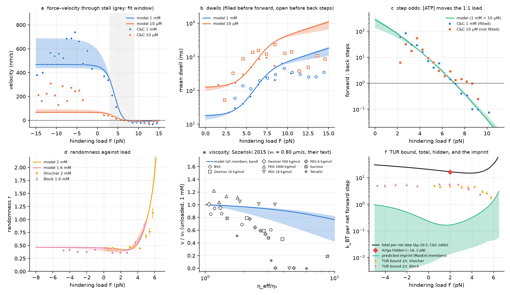

# Competing exits, session 2: is neck-linker docking a state bet?

**Plain summary.**

I tested whether kinesin-1 neck-linker docking behaves as a "state bet". In
that picture the docked landscape is the least-committed change from the
undocked tether that still reproduces the measured arrival times. The bet's
cost would appear as a mismatch dissipation, kT·D(p‖q), inside the motor's
hidden dissipation, and would show most clearly near the motor's limits.

I built the model from a diffusive first-passage solver. That solver
reproduces the earlier "v1" model's targets, and a new v3 model with it fits
Carter & Cross (C&C) as well as session 1 did. I then fixed the predictions
of the hypothesis in PREDICTIONS.md and committed that file before comparing
anything with data.

The outcome is negative, and it is specific:
* **The data need only a small bet.** C&C's arrival times require at most
  0.4 kT of commitment (at most 0.17 kT for the MaxEnt family). They need
  none at all if the undocked neck linker is as stiff as a worm-like chain
  and C&C's own scatter is used.
* **The bet's imprint is too small to see.** The predicted imprint is
  0.01–0.17 kT per step at 2 pN, about 1% of the ≈16 kT that Ariga et al.
  report as hidden. A Harada–Sasa experiment cannot resolve it: the
  load-dependence of the chemistry alone (≈2.6 kT between 2 and 4 pN in
  Takaki's fitted cycle) is 5–30 times larger.
* **Near the limits, the landscapes the data allow cannot be told apart**,
  except in their unloaded viscosity response. The bet is therefore not
  visible in the character of the curves.
* **The limit data contradict the model at many points:**
  - past stall the motor walks backward 1.4–5.6 times faster than predicted,
    with a flat ≈ 300-ms dwell where the model's grows to 0.7–1.8 s;
  - [ATP] moves the load at which forward and backward steps balance
    (the model says it cannot);
  - backward-step dwells are 1.3–4 times longer than forward-step dwells at
    intermediate loads;
  - small crowders slow the unloaded motor several times more than any
    candidate landscape predicts;
  - the balance load does not rise with temperature.

  Every candidate landscape fails in the same way, so these failures refute
  the kinetic scaffold (a diffusive forward search raced against a backstep
  gate), not the bet.

The thermodynamic uncertainty relation (TUR), applied to measured randomness,
bounds the total dissipation. The bound captures a quarter to a third of the
total at low load and falls to 7% near stall, so it goes slack there. It says
nothing about the imprint.

Deliverables: [PREDICTIONS.md](PREDICTIONS.md) (commit `84a3d19`, before any
comparison); figures 5–7 in `figures/`; tables in `results/tables_partB.md`
and `results/tables_partC.md`.

---

## Part 0. What exists

### 0.1 What is and is not in the folder

**Not in `papers/`**, and not reachable from this session (arxiv.org, PubMed
Central, journals.aps.org, pnas.org and similar hosts are blocked by the
environment's network policy):
* Ariga, Tomishige & Mizuno 2018, *PRL* 121:218101 (arXiv:1704.05302);
* Takaki, Mugnai & Thirumalai 2022, *PNAS* 119:e2208083119;
* Rice et al. 2003, *Biophys. J.* 84:1844 (neck-linker docking thermodynamics);
* Kawaguchi & Ishiwata 2000 (temperature series; noted already in session 1);
* Clancy et al. 2011, *NSMB* 18:1020 (source of the 600 s⁻¹ / 100 s⁻¹ rates
  used by Sozanski et al. and by head race v1);
* the supplements of Carter & Cross 2005 (Fig. S2, dwell histograms) and
  Guydosh & Block 2009 (Suppl. Fig. 7, 0.4-pN load).

There is also no `CONTEXT.md` in the repository on either branch, although the
brief asks for it; session 1's work was on branch
`claude/adoring-goldberg-17q637` and was fast-forwarded into this branch.

So the three quantities the brief calls "exact" (Ariga's hidden dissipation,
Takaki's split, Rice's docking free energy) can only be recorded **second-hand**
below, from papers in the folder that cite them, and, for Takaki, from the
authors' deposited code. Each is labelled with its source.

### 0.2 Ariga, Tomishige & Mizuno 2018 (hidden dissipation)

What the folder says, verbatim:

| source (in folder) | statement |
|---|---|
| Hwang & Karplus 2019, *PNAS*, p.7 of PDF | "For kinesin, under a 2-pN hindering load, 80% of the input energy by ATP was dissipated in sources other than work against the load or viscous drag (126). The authors concluded this 'hidden' dissipation to be internal, which should be due to the conformational fluctuation of the motor head itself." |
| Xie et al. 2019, *IJMS* 20:4911, p.19 of PDF | model efficiency "of about 16% for HsK is in agreement with the available single-molecule value determined recently at F = 2 pN [62]" (ref. 62 = Ariga 2018) |
| Brown & Sivak 2020, *Chem. Rev.* 120:434, p.437 | "under physiologically relevant conditions, kinesin dissipates most of its input free energy.¹⁰¹" |
| S.-W. Wang 2018 (arXiv:1710.10531), p.4 | Ariga et al. set the temperature from the high-frequency ratio C̃/2R̃′ "assuming that FDT is satisfied there"; with perturbation asymmetry the FDT is violated even at high frequency, which biases this calibration. |

Search-engine summaries of the abstract (not verifiable here, flagged): the
sum of probe dissipation and work "did not amount to the input free energy
change"; "kinesin loses 80% of input energy to heat"; the hidden part was
attributed to internal dissipation using a Langevin model of the probe
coupled to a two-state Markov stepper.

**What can be confirmed.**
* **Method.** Harada–Sasa: the probe's velocity correlation and response
  spectra, measured with optical tweezers, give the heat dissipated through
  the probe's degree of freedom. This is by construction an **ensemble-averaged,
  steady-state rate**; a per-step number is that rate divided by the mean
  stepping rate. It is not a per-step measurement.
* **Condition.** A **single** hindering load of **2 pN** (two independent
  folder sources). The ATP concentration, temperature, construct and probe
  details are **not recoverable** from the folder.
* **Value.** ~80% of the ATP free energy is "hidden". The absolute value and
  its uncertainty are not given in any folder source. For use below I take
  hidden ≈ 0.8 × Δμ with Δμ ≈ 20.5 k_BT (the reference line in Takaki's
  code, §0.3), i.e. **≈ 16 k_BT per step, uncertainty unknown** (a range of
  15–17 k_BT follows from Δμ = 19–21 k_BT alone).
* **A consistency check (mine).** At 2 pN the work per 8.2-nm step is
  16.4 pN·nm = 4.0 k_BT ≈ 20% of Δμ. So "80% hidden" means that almost all of
  the non-work free energy escaped the probe: the probe-visible dissipation
  was a small fraction of Δμ.

So the brief's belief is confirmed as far as the folder allows: one condition,
inferred from ensemble-averaged steady-state spectra. It is not confirmed
against the paper itself.

### 0.3 Takaki, Mugnai & Thirumalai 2022 (split of ~20.5 k_BT)

The paper is not available. Its deposited code
(`github.com/kibidanngo/information-flow-pnas`, `Kin1_PNAS.nb`) was cloned
read-only. It contains the fitted 5-state kinesin cycle (`param3`: k12 = 384.4,
k23 = 371.2, k34 = 459.5, k45 = 29.8 µM⁻¹s⁻¹·[ATP], k51 = 3×10⁵; reverse
k21 = 1.5·[ADP], k32 = 33.2, k43 = 2.7·[Pi], k54 = 94.7, k15 = 0.7 s⁻¹;
χ₁₂ = 0.4, θ = 1, d = 8 nm, k_BT = 4.114 pN·nm), fitted to force–velocity
data at 1 mM ATP/100 µM ADP/1 mM Pi and 10 µM/1 µM/1 mM. It defines
Q_chem = ln Π(k₊/k₋) over the chemical transitions 1→2→3→4→5 and
Q_mec = ln(k51/k15) for the mechanical step, and plots 20.5 k_BT as the input
free energy. The chemical and mechanical entropy production per cycle are
σ_chem = Q_chem + ln(p₁/p₅) and σ_mec = Q_mec + ln(p₅/p₁).

My evaluation of that code (a reconstruction, **not a number printed in the
paper**), at 1 mM ATP:

| load | Δμ (model) | σ_chem | σ_mec | work | v (model) |
|---|---|---|---|---|---|
| 0 pN | 20.3 k_BT | 14.4 | 6.0 | 0 | 884 nm/s |
| 2 pN | 20.3 | 11.3 | 5.1 | 3.9 | 568 nm/s |
| 4 pN | 20.3 | 8.7 | 3.8 | 7.8 | 177 nm/s |

A search-engine summary of the abstract (unverified) says "only a fraction of
the energy from ATP hydrolysis is used to advance kinesin motors against load,
with the rest associated with chemical transitions in the two heads", which is
consistent with σ_chem > σ_mec above.

### 0.4 The docking free energy (Rice et al. 2003)

Not in the folder. Second-hand values:

| source | statement |
|---|---|
| Block 2007, *Biophys. J.* 92:2986, p.2991 | Rice et al. "estimated the free energy associated with neck-linker docking, and found it to be just ~3 kJ/mol (note that k_BT is 2.6 kJ/mol)", i.e. ≈1.15 k_BT; Hackney argued the value is an underestimate because Rice used AMP-PNP |
| Xu et al. 2021, *J. Phys. Chem. B* 125:2627, p.2627 | docking "only has a free energy gain of ∼1.2 k_BT" (ref. 4 = Rice 2003) |
| Taniguchi et al. 2005, *Nat. Chem. Biol.* 1:342, p.342 and p.345 | "only 1–2 k_BT" |
| Sumi 2017, *Sci. Rep.* 7:1163, p.2 | "about 3 kJ/mol" |

I use **1.2 k_BT** as the docking budget, with 1–2 k_BT as its range.

### 0.5 Datasets that approach a limit

Every value marked *(fig)* was read off a figure by `analysis/digitize_figures.py`
(vector extraction for Carter & Cross, pixel digitisation otherwise); the CSVs
are in `data/digitized/`.

**(a) Load: force–velocity near and past stall**

| dataset | motor, conditions | how close to the limit |
|---|---|---|
| Visscher et al. 1999, *Nature* 400:184, Fig. 3a (p.186) | squid kinesin, force clamp, 2 mM and 5 µM ATP | 2 mM: 854 → 148 nm/s at 6.3 pN *(fig)*; "stall force of ~7.0 pN" (p.186). 5 µM: 56 → 5.7 nm/s at 5.6 pN *(fig)*; stall ~5.5 pN. Stops short of stall. |
| Carter & Cross 2005, *Nature* 435:308, Fig. 2c (p.310) | full-length *Drosophila*, 23 °C, 1 mM and 10 µM | **through and past stall**: 1 mM from 824 nm/s (trap off) to −31 nm/s at 12.6–13.5 pN; 10 µM from 142 to −22 nm/s *(fig, vector)* |
| Block et al. 2003, *PNAS* 100:2351, Fig. 4A (p.2354) | 1.6 mM, 4.2 µM ATP; 2-D force clamp | 1.6 mM: ~650–700 → 128 nm/s at 4.7 pN hindering *(fig)*; "near zero between −4 and −6 pN" (p.2354) |
| Nishiyama et al. 2002, *NCB* 4:790, Table 1 (p.790) | bovine brain kinesin, 298 K | v = 930, 230, 0 nm/s at 0, 3.8, 7.6 pN (model rates from dwells) |
| Kondo et al. 2023, *Traffic* 24:463 | mouse KIF5A, 25 °C | zero velocity ~9.1 pN; loads to >40 pN (session 1) |
| Khalil et al. 2008, *PNAS* 105:19247, Table 1 (p.19250) | *Drosophila* K401 WT and cover-strand mutants | stall forces 4.96 ± 0.05 (WT), 3.02 ± 0.03 (2G), 1.37 ± 0.04 pN (DEL, biased high) |

**(b) Randomness against load and ATP**

| dataset | conditions | how close to the limit |
|---|---|---|
| Visscher 1999, Fig. 4b (p.187) | 2 mM ATP | r = 0.41–0.48 from 0.5 to 4.2 pN; **0.68 ± 0.06 (5.0 pN), 0.77 ± 0.07 (5.4 pN), 1.13 ± 0.10 (5.76 pN)** *(fig)*. Last point ~1.2 pN below stall. |
| Visscher 1999, Fig. 4a (p.187) | r vs [ATP] at 1.05, 3.59, 5.69 pN | 5.69 pN: r = 0.74, 0.79, 0.83 at 0.4, 2, 5 mM *(fig)*; "unable to measure r for 5.69 pN at more than a few ATP levels" (p.187) |
| Block 2003, Fig. 4C (p.2354) | 1.6 mM, 4.2 µM | 1.6 mM: r = 0.36–0.42 from −4.7 (assisting) to 2.7 pN hindering; **0.55 ± 0.04 at 3.7 pN, 0.86 ± 0.06 at 4.8 pN** *(fig)*; text: r = 0.38 ± 0.01 over "−3 to 5 pN". 4.2 µM: 0.8–1.2 |
| Yildiz et al. 2008, *Cell* 134:1030, p.1033 | one head labelled, low ATP | r = 0.57 (WT); 0.97–1.01 for neck-linker-extended mutants (futile cycles) |

**(c) Forward:back ratio against load**

| dataset | how close |
|---|---|
| Carter & Cross 2005, Fig. 2a inset (p.310) | ratio = 802 e^(−0.95F) through 1:1 at 7.04 pN (their fit); 1 mM points 2.2–10.2 pN, down to ~0.08 *(fig, vector)*; the 10 µM points reach 1:1 only near 8.7 pN *(fig)* |
| Nishiyama 2002, Fig. 4b and Table 1 | R0 = 221, d = 2.9 nm (d_f = 3.0, d_b = 0.1 nm); 1:1 at 7.6 pN |
| Taniguchi 2005, p.343 and Table 1 | P(forward) = 0.5 at ~8 pN at every temperature; ln(ratio) linear in load ("data not shown") |
| Kondo 2023 (session 1) | 44:1 unloaded; lever 2.22 nm above 3.19 pN; 1:1 at 9.3 pN |

**(d) Dwell distributions near stall**

| dataset | finding |
|---|---|
| Carter & Cross 2005, p.309 | "At any particular backward load, dwell times are exponentially distributed (Supplementary Fig. S2)" — supplement not in folder. Mean backward-step dwells (Fig. 2b, *fig*): at 1 mM, 59, 138, 113, 196 ms at 3.6–6.6 pN against forward 30, 41, 66, 152 ms; similar near stall (235 vs 246 ms at 7.5 pN); **load-independent superstall** (~250–460 ms, 7.5–14.5 pN); at 10 µM ~0.4–2.3 s. |
| Nishiyama 2002, p.793 | dwells before back steps and detachments "could be essentially described by the curve fit used for the 8-nm steps" |
| Taniguchi 2005, p.343 | forward dwell histograms need **two** rate-limiting transitions even at 35 °C and 5.5–7.5 pN (χ²(29) = 30 vs 110 for one); backward and detachment time constants equal to forward |
| Kondo 2023, pp.467–468 | slow-event dwells single-exponential; backward/forward dwell ratio 1.22 ± 0.23, detachment/forward 1.21 ± 0.32 (3–12 pN); fast backsteps with 0.4-ms dwells |

**(e) Viscosity**

Sozański et al. 2015, *PRL* 115:218102 (297 ± 2 K, 1 mM ATP, TIRF at
10 frames/s, truncated GFP-kinesin-1):
* Fig. 2b *(fig)*: speed falls from ~0.75–0.84 µm/s to ~0.4 µm/s by
  η_eff/η₀ ≈ 3 (small crowders). "No motion observed" at η_eff/η₀ = 3.5–6 for
  PEG 6k, PEG 18k and TetraEG, but sucrose still moves (0.15 µm/s) at 8.8.
* Text (p.218102-2): "stalling at about 5 mPa·s"; "movement events become rare
  … up to the point where no motion is observed" (p.218102-3). So the "stop" is
  partly a loss of runs, not necessarily a stalled stepping cycle.
* Michaelis–Menten (p.218102-3): V_max = 103.4 ± 0.2 s⁻¹, K_M = 311 ± 2 µM
  (control); 52.4 ± 1.4 s⁻¹, 474 ± 54 µM (30% sucrose).
* Their fit maps one unit of η_eff/η₀ to ~1.5 pN of external load (p.218102-4).
* Their model quotes Clancy 2011 for 600 s⁻¹ (tethered-head step, "2→3") and
  ~100 s⁻¹ (ATP dissociation); these are v1's search and clock rates.

The limit is approached closely in the sense that motion ceases, but the
velocities of the last moving points are noisy and the crowders disagree.

**(f) Temperature**

| dataset | range | finding |
|---|---|---|
| Taniguchi 2005, Tables 1–2 (p.345) | 280–308 K, bovine brain, 1 mM ATP | k_f0 = 100 → 1353 s⁻¹, k_b0 = 0.28 → 3.8 s⁻¹; ΔH‡ = 18.3 ± 1.1 (forward), 18.2 ± 1.4 k_BT₀ (back); ΔS‡ = 9.9 ± 1.1, 3.9 ± 1.4 k_B; slow dwell phase doubles per 10 °C drop, fast phase less (p.344). *Added in Part C:* these ΔH‡ exclude the diffusion-limited prefactor A_T = k_BT/(3πηr x₀²) (Methods, p.346). The raw Arrhenius enthalpies of Table 1's k_f0 and k_b0 are 26.7 ± 1.1 and 26.4 ± 1.4 k_BT₀ (my weighted fits); k_c (their load-independent step) has 13.8 ± 0.7 k_BT₀. |
| Hong et al. 2016, *Biophys. J.* 111:1287, p.1289 | ~5–27 °C (Arrhenius fit to 8 °C), KIF5A | velocity Ea ≈ 65 kJ/mol (≈ 26 k_BT at 298 K); force 5.3 ± 0.2 pN (295 K) vs 5.2 ± 0.2 pN (280.5 K) |
| Kawaguchi 2008 (review) | — | no new temperature data |

Neither end of 5–40 °C is reached with backstep counts: Taniguchi covers
7–35 °C, Hong's velocities go down to ~5–8 °C.

**(g) Docking and neck-linker mutants**

| dataset | finding |
|---|---|
| Budaitis et al. 2019, *eLife* 8:e44146, p.6 | KIF5C(1-560): cover-neck-bundle (CNB), Latch and CNB+Latch mutants are **faster** unloaded (0.771, 0.761, 0.788 vs 0.617 µm/s WT) and more processive (2.07, 4.27, 5.33 vs 0.99 µm), but detach at 0.91, 0.84, 0.81 pN without stalling (WT 4.6 ± 0.8 pN). No ATPase measured; MD (p.8) suggests enhanced catalytic-site closure. Room temperature. |
| Khalil et al. 2008, Table 1 (p.19250) | 2G mutant: unloaded v and run length "at least those of WT", "suggesting that its ATPase machinery was unaffected" (an inference, p.19249); stall 61% of WT |
| Yildiz 2008, p.1033 | neck-linker-extended mutants: k_cat similar to WT but 5–10× slower motion (futile hydrolysis) |
| Andreasson et al. 2015, *eLife* | neck-linker length series; cysteine-light caveat (session 1) |

**(h) Where the waiting head is (for p) and how floppy the undocked tether is (for p₀)**

| dataset | finding |
|---|---|
| Mickolajczyk et al. 2015, *PNAS* E7186, p.E7187 | labelled head's substep 8.4 ± 3.0 nm (mean ± SD, 78% component) from its rear site: the tethered intermediate sits over the bound head; 1HB state 8.0 ± 0.5 ms at 1 mM; the motor **waits for ATP with two heads bound** (≥ 10 µM), and the tethered state follows ATP binding and precedes hydrolysis; "ATP binding only partially docks the NL and hydrolysis completes docking" |
| Guydosh & Block 2009, *Nature* 461:125, p.126 | with a bead on one head, ±1.7 pN alternating loads move the unbound head through ~23 nm; "similar transitions" at ±0.4 pN; "the unbound head is mobile, and can be readily pulled about its bound partner and even rotated" |
| Kutys et al. 2010, *PLoS Comput. Biol.*, p.4 | WLC neck linker: L_p = 0.7 nm fits MD; 0.364 nm per residue (14 residues ≈ 5.1 nm) |
| Xu et al. 2021, p.2629 | WLC with l_c = 10 nm, l_p = 0.5 nm |

---

## Part A. The diffusive head race: v1 rebuilt, v3 built

### A.1 The first-passage tools (`competing_exits/diffusion.py`)

The overdamped search in a landscape U(x) on [−8, 8] nm is a
Scharfetter–Gummel birth–death chain with rates (D/h²)·B(ΔU), where
B(z) = z/(eᶻ − 1). It obeys detailed balance with respect to e^(−U) exactly,
and converges as h².

Two solvers use the same chain:
* **Capture.** Capture probabilities and mean capture times come from the
  exact birth–death nested sums, evaluated in log space. They are
  machine-precise even behind 40-kT walls.
* **Races.** Races against Poisson clocks (the gate, ATP release) are solved
  as absorbing chains. They give each exit's probability and the first two
  moments of its time.

Reflecting walls use half cells, which makes free diffusion with a wall exact.

Checks (`tests/test_diffusion.py`):
* the continuum nested-integral formulas: splitting to 10⁻⁷, mean time to
  2×10⁻⁵ at N = 6400;
* the free-diffusion closed forms with a clock and with a reflecting wall;
* h² convergence.

### A.2 v1 reproduced (`tests/test_headrace_v1.py`)

| target | brief | this code |
|---|---|---|
| unloaded search rate | 600 s⁻¹ (sets B = 9.144 kT) | 600.2 s⁻¹ |
| front barrier, 0 → 6 pN | 10.98 → 14.42 kT | 10.98 → 14.42 |
| rear barrier, 0 → 6 pN | 20.06 → 14.67 kT | **19.98** → 14.67 |
| speed at 0, 3, 6 pN | 780, 454, 104 nm/s | 780.5, 454.4, 103.6 |
| P_win at 0, 3, 6 pN | 0.857, 0.533, 0.121 | 0.857, 0.533, 0.121 |
| front = rear | 6.17 pN | 6.171 pN |

**The choices the brief left open:**
* **Barrier shape.** A Gaussian with **standard deviation** 0.7 nm. It is the
  only one of nine shapes tried that gives 600 s⁻¹ at B = 9.144 kT; the
  others give 470–4350 s⁻¹. The nine were: a Gaussian with 0.7 nm as the SD,
  the e-folding length or the FWHM; and cos², tent, parabola and box shapes
  with 0.7 nm as the half- or full width.
* **Sensitivity to that choice.** If B is re-tuned to 600 s⁻¹ for each shape,
  the other targets move to:
  - P_win(3 pN) 0.533–0.561 and P_win(6 pN) 0.121–0.139;
  - v(3 pN) 454–482 and v(6 pN) 104–121 nm/s.

  The 6.17-pN balance point does not move, because it is where the two
  barrier tops are level.
* **Barrier height.** "Barrier" means U(±6 nm) − min U.
  - This reproduces three of the four barrier targets to 0.01 kT.
  - The rear barrier at zero load comes out 19.98 kT, not 20.06. No shape or
    definition gives all four. The true maxima of the potential are
    11.01 → 14.51 and 20.16 → 14.76.
  - The 0.08-kT discrepancy has no effect on any dynamic target.
* **The rest of v1.** The speed targets fix it:
  - the step is d = 8.0 nm (8.2 gives 800 nm/s at zero load);
  - rear capture is a futile restart, with no displacement and no rest time,
    like the clock.

  The alternatives fail: rear capture as a −8-nm backstep gives 22 nm/s at
  6 pN, and as a futile event followed by the 8-ms rest, 96 nm/s.
* **The race approximation.** P_win is k_f/(k_f + k_r + k_c), with
  k = P(site)/E[search time]. The full diffusive race, with the clock as a
  uniform killing rate, agrees with it to four digits.

### A.3 v3: the docked landscape for the front search, a gate for the rear exit

**The model** (`competing_exits/headrace.py: head_race_v3`):
* **Front search.** After ATP binds, the head searches for the FRONT site
  (+8 nm) in a docked landscape: a harmonic tether (κ′, x′) plus a Gaussian
  binding barrier B at +6 nm. The geometry, D and the F/2 load rule are v1's.
* **Start.** The search starts from p = N(0.2 nm, 1/0.21 nm²), tilted by the
  load.
  - The mean is Mickolajczyk 2015's 8.4-nm substep minus 8.2 nm.
  - The width is the worm-like-chain neck linker of Kutys 2010:
    κ = 3/(2 L_p L) with L_p = 0.7 nm and L = 28 × 0.364 nm.
* **Rear.** The rear end reflects: there is no diffusive rear capture. A
  Poisson gate k_b(F) = k_b0·e^(−Fδ_b/kT) competes with the search instead, as
  the session-1 lesson requires.
* **Other exits.** The clock k_c (ATP leaves, restart). After either step
  comes the rest of the cycle, T (in Part B, two equal exponential stages).
  The ATP wait is 1/(k_on[ATP]).
* **Parameters.** Eight are fitted: κ′, x′, B ≥ 0, k_b0, δ_b, k_c, k_on, T.
  The others are fixed: kT = 4.087 pN·nm (23 °C), water 0.932 mPa·s,
  d = 8.2 nm, D = 93.1 nm²/µs (Stokes–Einstein, 2.5-nm head).
* **Race approximation.** The competing-exits treatment (capture as a Poisson
  exit) agrees with the full diffusive race with the gate and clock:
  - within 2×10⁻³ from 0 to 12 pN (`tests/test_bet.py`);
  - within 10⁻³ from −15 to +15 pN (checked in Part B).

**The fit** is to C&C's three relations (ratio, dwell at 1 mM, dwell at
10 µM), each sampled at 3, 4, …, 9 pN as in session 1 (`analysis/part_a_v3.py`,
`results/part_a_v3.json`). There are two weightings:
* session 1's assumed per-bin scatter: σ(ln dwell) 0.10, σ(ln ratio) 0.20;
* the scatter of C&C's own plotted bins about their fits, which I digitised
  from the vector figure. The RMS is 0.31 for the 1-mM dwells (0.15 without
  one outlier) and 0.33 for the 1-mM ratio; rounded, I use 0.20 and 0.33.

| | session-1 weights | data weights | v2 refit (session 1) |
|---|---|---|---|
| χ² (21 points) | 16.54 | 4.33 | 16.14 |
| κ′ (kT/nm²), x′ (nm) | 0.410, 0.91 | 0.403, 0.87 | — |
| B (kT) | 0 (at its bound) | 0 (at its bound) | — |
| k_f(F = 0) (s⁻¹) | 2170 | 2260 | 5063 |
| k_b0 (s⁻¹), δ_b (nm) | 6.42, 0.58 | 6.30, 0.57 | 8.06, 0.69 |
| k_c (s⁻¹), k_on (µM⁻¹s⁻¹), T (ms) | 57.6, 1.07, 14.2 | 56.9, 1.06, 14.4 | 52.9, 0.98, 15.7 |
| 1:1 load (pN) | 7.15 | 7.13 | 7.06 |
| v at 0 pN, 1 mM (nm/s) | 522 | 516 | 454 (v2) |

**What the fit says.**
* **Fit quality.** The diffusive front search fits C&C as well as v2's
  exponential forward rate does.
* **No barrier needed.** The best docked tether needs no binding barrier
  (B = 0). The capture barrier is then the tether's own rise to the site,
  (κ′/2)(8 − x′)² ≈ 10.3 kT.
* **Effective load distance.** Under 3–9 pN the head's mean position in the
  tilted docked landscape is 0.0 to −1.8 nm, which is 8.0–9.8 nm below the
  capture point (+8 nm). Half of that (the head feels F/2) is 4.0–4.9 nm,
  close to v2's δ_f ≈ 4.3–4.4 nm.
* **Unloaded speed still missed.** Session 1's miss remains: 522 against
  824 nm/s (the trap-off bead velocity, vector-extracted from C&C Fig. 2c;
  session 1 read 829).
* **The gate slows under load.** δ_b = 0.58 nm > 0: the fitted gate becomes
  slower under hindering load. This is inherited from C&C's dwells at
  3–9 pN, and Part C shows it fails past stall.

**Check against Kondo et al. 2023** (KIF5A, 25 °C), with v3 expressed in
Kondo's definitions (steps of a direction per unit time: that direction's
fraction divided by the mean dwell):
* **Forward rate: the same shape.**
  - v3 is nearly flat below ~2 pN (effective distance 0.29 nm) and falls
    above (3.7 nm at 4–8 pN).
  - Kondo's forward rate has a knee at 3.19 pN, with 0.17 nm below and
    1.78 nm above. Drosophila KHC is steeper under load.
* **Backstep rate: disagrees in structure.**
  - v3's effective backstep rate rises ~12× from 0 to 6 pN (0.19 → 2.2 s⁻¹)
    and then falls.
  - Kondo's rises 1.9× (1.99 → 3.78 s⁻¹) and keeps rising.
  - In v3 the gate fires only during the ATP-bound race, which is a small part
    of the cycle at low load. Kondo's gate acts from a state that fills the
    cycle.
* **Backward/forward dwell ratio: consistent.** v3 gives 1 by construction;
  Kondo reports 1.22 ± 0.23.

---

## Part B. The valley, the MaxEnt member, and the predictions

Part B is written up in full in **[PREDICTIONS.md](PREDICTIONS.md)**, committed
as `84a3d19` before `analysis/part_c_confront.py` existed in the repository or
had been run. The main results:

**B.1 The valley.**
* Under session-1 weights, the docked tethers that fit C&C within
  Δχ² ≤ 5.99 form a curved ridge: κ′ = 0.10–0.46 kT/nm², x′ = 0.4–5.2 nm.
  - One end is stiff and centred near the bound head, with no barrier.
  - The other end is floppy and parked forward, with a barrier of ~11 kT.
* Under data weights the ridge is wider: κ′ 0.06–0.52, x′ 0–8 nm.
* Two landscape parameters suffice to describe the ridge at the data's
  precision, but the binding barrier is refitted along it.

**B.2 The MaxEnt member and the budget.**
* **No bet (q = p₀).**
  - Under session-1 weights it misses C&C at every κ₀ in the bracket
    0.01–0.30 kT/nm² (Δχ² 18–89).
  - Under C&C's own scatter it fits at κ₀ = 0.21, the worm-like-chain value
    (Δχ² 5.05).
* **Least commitment D(q‖p₀).** At most 0.38 kT in the Gaussian family and
  at most 0.17 kT in the I-projection family. These are upper bounds on the
  least commitment over all landscapes that fit.
* **The MaxEnt bet's shape.** In the I-projection family it is a soft rear
  wall, not a forward shift: it suppresses excursions behind x ≈ −4 to −5 nm.
* **The budget.** The ~1.2 kT docking budget never binds at the MaxEnt
  member. It removes the forward-parked end of the valley (x′ ≳ 3–4 nm), and
  only when κ₀ ≥ 0.21.

**Choice of p.** p, the head's distribution when docking starts, is the same
density the search starts from, for every κ₀. The reading "p = the undocked
equilibrium" is carried as a variant. It raises the imprint to 0.58–0.98 kT
when κ₀ = 0.03. For κ₀ = 0.03 that variant is internally inconsistent,
because the fit's start distribution is the narrower worm-like-chain one.

**B.3–B.4 Predictions and discrimination.** Seven members were carried to the
limits: two I-projection and two Gaussian MaxEnt members (κ₀ 0.03 and 0.21),
the best fit, a mid-valley member and the floppy edge. The conditions were:
* load from −15 to +15 pN, at the ATP concentrations of C&C, Visscher and
  Block;
* viscosity from 1 to 10 η₀;
* temperature from 5 to 40 °C.

Their predictions for the near-stall kinetics (v, the 1:1 load, randomness,
odds, dwell CV) differ by less than about 1.4 times a realistic measurement
precision. The only strongly discriminating feature is the unloaded
viscosity response: v(5η₀)/v(η₀) = 0.63–0.91. It follows the unloaded capture
rate, which the 3–9 pN constraints do not fix. The imprint is 0.006–0.23 kT per
committed step at F = 0 for the MaxEnt members, and at most 1 kT for any
member. Figures 5 and 6 are in PREDICTIONS.md.

---

## Part C. Confrontation with the limit datasets

Everything in this Part was computed after the predictions were committed.
The script is `analysis/part_c_confront.py`, and it writes
`results/part_c_confront.json`, `results/tables_partC.md` and
`figures/fig7_confront.png`. Unless marked "post hoc", nothing in PREDICTIONS.md
was changed.

**Figure 7.** Predictions (bands: all seven members; lines: the mean of the
MaxEnt members) against the data:
* (a) C&C force–velocity. The grey band is the constraint window.
* (b) C&C mean dwells before forward (filled) and backward (open) steps.
* (c) C&C forward:back odds at 1 mM (fitted) and 10 µM (not fitted).
* (d) Randomness: Visscher at 2 mM, Block at 1.6 mM.
* (e) Sozański's velocity against the effective viscosity at the head.
* (f) The TUR bound 2/r from the measured randomness. Also shown, per net
  forward step: the total dissipation (Δμ = 20.5 kT with C&C's odds),
  Ariga's hidden dissipation, and the predicted imprint.

### C.1 Scorecard

[v3] marks a test of the kinetic scaffold shared by all members; [bet] marks a
test specific to the hypothesis. "z" is (data − model)/s.e.m.

| # | prediction | data | outcome |
|---|---|---|---|
| P1 [v3] | v through stall. Past stall: most negative −10 to −12 nm/s at 9–10 pN, then back toward 0. Saturation under assisting load. | C&C Fig. 2c past stall: **−16 to −31 nm/s at 8.5–14.5 pN, most negative at 12.6–13.5 pN**. Assisting, 1 mM: 381–739 nm/s. Assisting, 10 µM: 130–309 nm/s against a predicted 63–93. | **Fails** past stall: 2–5× too slow and the wrong trend. Fails at 10 µM under assisting load (2–4×). At 1 mM under assisting load, only the fast members reach the data. |
| P2 [v3] | Odds at 10 µM equal those at 1 mM | C&C Fig. 2a: ln(odds 10 µM / odds 1 mM) = **+0.95 ± 0.29** over the 7 bins above 6 pN. The 1:1 load is ≈ 8.7 pN at 10 µM against 7.1 at 1 mM. | **Fails** (3.3 s.e.). Over all bins +0.25 ± 0.28. |
| P3 [v3] | r against load | Block, 1.6 mM: r = 0.55 ± 0.04 and 0.86 ± 0.06 at 3.7 and 4.8 pN (model 0.47–0.58 and 0.80–0.92). Block at ≤ 2.7 pN: 0.36–0.42 (model 0.37–0.46). Visscher, 2 mM: fits to 3.6 pN, but 0.44–1.13 at 4.2–5.8 pN (model 0.58–1.62). Block, 4.2 µM: 1.20 ± 0.05 at 2 pN (model 0.91–0.93). | **Mixed.** Block near stall passes (z ≤ 2.1). Block at low load is 1–4 s.e.m. high. Visscher at 4.2–5.8 pN is z −4 to −7. Block at 4.2 µM and 2 pN is z +5.5. |
| P4 [v3] | r against [ATP] | Visscher Fig. 4a at 5.69 pN: 0.74–0.83 (model 1.44–1.53). At 1.05 and 3.59 pN (markers merged): 1.09–1.35 at ≤ 10 µM (model 0.77–1.07); 0.78–1.23 at 40–70 µM (model 0.37–0.70); 0.37–0.70 at 100–400 µM (model 0.33–0.58). | **Fails** at 5.69 pN (z ≈ −6). The data sit above the model at ≤ 100 µM. |
| P5 [v3] | Backward and forward dwells equal; mean dwell past stall grows with load | C&C Fig. 2b: backward/forward mean dwell 1.3–3.4 at 3.6–6.6 pN (1 mM) and 1.7–4.3 at 3.4–8.5 pN (10 µM); 0.7–1.5 near and past stall (1 mM). Kondo 1.22 ± 0.23. Backward dwell past stall **252–348 ms, flat, at 10.5–14.5 pN** (model 0.68–1.81 s). At 10 µM: 0.38–1.42 s at 9.7–14.5 pN (model 3.7–11.2 s). | **Fails** at intermediate loads and past stall; consistent near stall and with Kondo. |
| P6 [v3, bet] | v(5η₀)/v(η₀) = 0.63–0.91, no stop below 10η₀ | Sozański Fig. 2b, small crowders: v/v₀ = 0.46–0.61 at η_eff = 2.8–3.9 η₀ (BSA, Dextran 10k, PEG 6k, sucrose), 0.12 at 3.2 (TetraEG); **no motion** for PEG 6k from 3.5 and PEG 18k at 4.5. Large crowders ≈ 1.0 up to 3.45 η₀. | **Fails** for small crowders (model 0.70–0.96 at those η). Every member underpredicts the slowdown 1 − v/v₀: the MaxEnt members by 3–13×, the floppy edge by 1.3–2.6×. The floppy edge comes closest, as B.4 anticipated, but it too misses. |
| P7 [v3] | 1:1 load ∝ T (+0.34%/K) | Taniguchi Table 1 (1:1 load = kT·ln(k_f0/k_b0)/(d_f − d_b)): 9.47, 10.51, 9.22, 8.92 pN at 280–308 K, slope **−0.36 ± 0.28%/K**. Hong's force 5.2 ± 0.2 vs 5.3 ± 0.2 pN at 280.5 and 295 K (ratio 0.98 ± 0.05; model 0.951). | **Fails** at 2.5 s.e.m. (Taniguchi). Hong is consistent but weak. The velocity part of P7 was mis-scaled (C.6). |
| P8 [bet] | Commitment ≤ 0.38 kT, within the budget | none direct | untested (context: Taniguchi's 6 k_BT directional bias is 3–6× the docking energy, p.345) |
| P9 [bet] | Imprint 0.013–0.165 kT per step at 2 pN (≤ 1% of hidden) | Ariga's ~16 kT hidden (second-hand) | consistent, not a test |
| P10 [bet] | Imprint rises toward stall (I-projection members) | no per-step hidden dissipation against load | untested |
| P11 [bet] | Differences in which chemistry cancels ≤ 0.5 kT | no data | untested |

**What the scorecard says.**
* **The scaffold fails near every limit the data reach:**
  - past stall;
  - under [ATP] changes;
  - in the backward/forward dwell ratio;
  - in small crowders;
  - against temperature;
  - near stall for Visscher's construct.
* **The failures do not discriminate between members.** At every failing
  feature the seven members agree with each other to within the data's
  resolution; in viscosity they differ, but none approaches the data. So the
  failures refute the kinetic scaffold, not any particular bet.
* **The bet-specific predictions (P8–P11) cannot be tested** with any dataset
  in the folder.
* **"The signal is strongest near the limits, in the character of the
  curves" cannot be supported here.** In the model, the near-limit character
  is fixed by the constraints and the scaffold, not by the bet. The measured
  character differs from the model's for reasons every member shares.

### C.2 Per dataset (every Part 0 dataset)

**Load.**
* **C&C Fig. 2c** (1 mM and 10 µM, −15 to +15 pN).
  - Inside the 3–9 pN window the velocity bins are not independent of the fit.
    The model is 7–49% faster than the bins at 1.6–4.6 pN; its 1:1 load is
    7.0–7.2 pN, against a velocity zero crossing at ≈ 6.5 pN.
  - **Past stall** (independent): data −16 to −31 nm/s at 1 mM and −4.5 to
    −22 nm/s at 10 µM (8.4–14.5 pN). Model −4.5 to −11 and −0.7 to −2.0. The model's
    backward speed past stall collapses because the fitted gate slows under
    load (δ_b = 0.4–0.8 nm) and, in v3, fires only after ATP binds.
  - **Assisting loads, 10 µM:** stepping is 2–4× faster than v3 allows. v3's
    ATP wait (≈ 94 ms at 10 µM) is load-independent; C&C's dwells under
    assisting load are 22–50 ms. This is direct evidence for **load-dependent
    ATP binding**, or for ATP-independent forward steps under assisting load.
* **Visscher 1999 Fig. 3a** (squid kinesin, 2 mM and 5 µM).
  - At 2 mM the model, fitted to C&C, is 120–420 nm/s too slow at every load
    (z 8–32 for the MaxEnt members). Visscher's motor holds 478 nm/s at 5 pN, where C&C's gives
    ≈ 110. The two force–velocity curves have different shapes, so no single
    parameter set fits both.
  - At 5 µM the model matches from 3.6 to 5.6 pN (z −3.0 to +2.3) but is
    16–42% low at ≤ 1 pN.
* **Block 2003 Fig. 4A** (1.6 mM and 4.2 µM, −8 to +5 pN).
  - At 1.6 mM: 100–270 nm/s too slow at low and assisting loads for the MaxEnt
    members (the known unloaded miss; only the floppy edge reaches the
    assisting-load data). Close near stall (310 vs 267–273 nm/s at 3.7 pN; 128 vs 138–149 at
    4.75 pN).
  - At 4.2 µM: data fall 8× from −1 to +4.25 pN, the model only 2–2.7×.
    Load-dependent ATP binding again.
* **Nishiyama 2002** (Table 1).
  - v(3.8)/v(0) = 0.25, against the model's 0.43–0.61.
  - Zero-load odds R₀ = 221, inside the model's 135–338.
  - Total load distance 2.9 nm, against the model's 3.3–3.7 nm.
  - 1:1 at 7.6 pN, against 7.0–7.2.
* **Kondo 2023.** See Part A: the forward-rate shape is shared and the
  backstep-rate structure differs. The 1:1 load is 9.3 pN (KIF5A; a different
  motor).
* **Khalil 2008.** The K401 stall force is 4.96 pN, a different construct
  from C&C's full-length KHC. Not a test.

**Randomness.**
* **Visscher Fig. 4b.**
  - r is 0.41–0.48 to 4.2 pN, where the model agrees (z within ±2.5) up to
    3.6 pN.
  - At 4.2–5.8 pN the model is too high (z −4 to −7) on an absolute-load
    axis.
  - Compared at equal v/v(0), however, the model is too **low**. At
    v ≈ 0.45 v(0), Visscher has r = 1.13 while the model has 0.5–0.6.
    Visscher's randomness rises while the motor still runs at half speed.
    No member does that.
* **Visscher Fig. 4a.**
  - At 5.69 pN: 0.74–0.83 against 1.44–1.53 (same construct caveat).
  - At low [ATP], r = 1.09–1.35 (six points) against 0.77–1.07. The data sit
    above 1, which a single-state race without backsteps cannot produce.
* **Block Fig. 4C.**
  - At 1.6 mM the near-stall character is right (3.7 and 4.8 pN). The model is
    0.02–0.08 too high at low and assisting loads.
  - At 4.2 µM the data rise from 0.77 (assisting) to 1.20 (2 pN); the model
    goes from 0.88 to 0.93.
* **Yildiz 2008.** r = 0.57 for one labelled head (16-nm steps, low ATP): a
  different observable, not compared.

**Odds.**
* **C&C.** In the fit window the 1 mM residuals are within ±0.7 in ln. At
  10 µM the odds are **higher** than at 1 mM above 6 pN, by a factor of e^0.95.
  v3 cannot produce this: the race is decided after ATP binds.
* **Nishiyama.** See above.
* **Taniguchi.** P(forward) = 0.5 at "about 8 pN" at all temperatures (p.343),
  counting detachments. See C.6.
* **Kondo.** 44:1 unloaded and 1:1 at 9.3 pN. The model gives 135–338 at
  zero load: the zero-load odds are an extrapolation and are not
  constrained.

**Dwells.**
* **C&C.**
  - Backward dwells are 1.3–4.3× the forward ones at intermediate loads;
    about equal near stall.
  - Past stall they are flat at ≈ 300 ms (1 mM), against a model that rises to
    0.7–1.8 s.
  - C&C report exponential dwells at every load (p.309). The model's CV is
    0.92–0.98 near and past stall: consistent.
* **Nishiyama (p.793).** Dwells before back steps follow the forward-step
  curve: consistent with P5.
* **Taniguchi (p.343).** Two rate-limiting transitions even at 35 °C and
  5.5–7.5 pN. The model's dwell has the rest of the cycle (two stages) plus
  the race. Its CV at 35 °C and 5 pN is 0.66–0.78 (1/CV² = 1.6–2.3):
  consistent.
* **Kondo.** Slow-event dwells are single-exponential, with a
  backward/forward ratio of 1.22 ± 0.23: consistent.

**Viscosity (Sozański).**
* **The control.** v₀ = 0.80 µm/s, from "about 800 nm/s" (p.218102-2).
* **Small crowders** slow the motor far more than the model at the same
  η_eff: v/v₀ 0.46–0.61 at 2.8–3.9 η₀, against 0.70–0.96. The MaxEnt members
  underpredict the slowdown 3–13×, the floppy edge 1.3–2.6×.
* **Stops.** PEG 6k stops at η_eff 3.5 and PEG 18k at 4.5. PEG 18k runs at
  full speed at 3.45 η₀ and then stops, so the stop is not a viscous
  slowdown; Sozański note loss of runs (p.218102-3).
* **Large crowders** (PEG 1000k, Dextran 500k, PEG 18k ≤ 3.45) show no
  slowdown, and neither does the model at their low η_eff. Consistent, but
  weak.
* **Summary.** In v3 the diffusive search is too fast (600–3200 s⁻¹) to limit
  the unloaded cycle. The small-crowder data need a diffusive or
  viscosity-coupled step that limits the cycle at zero load. That is
  incompatible with the C&C-constrained search rate unless another
  η-sensitive transition exists; the η-sensitive gate variant makes it worse.

**Temperature.** See C.6. Taniguchi's 1:1 load does not rise with T. Hong's
force data are too coarse to decide.

**Docking and neck-linker mutants.** No prediction of mutant kinetics was
committed, so these are comparisons of scale only:
* **Budaitis 2019.** CNB and latch mutants detach at 0.8–0.9 pN (WT
  4.6 ± 0.8), and are faster and more processive unloaded.
* **Khalil 2008.** The 2G cover-strand mutant stalls at 61% of WT.
* **The contrast with the bet.** Weakening docking costs much of the force.
  The bet the C&C arrival times need is ≤ 0.4 kT and can be zero (κ₀ 0.21,
  data weights). So in the state-bet reading, docking's measured mechanical
  importance is not carried by the bet.
  - Either the undocked tether is floppy, which makes the no-bet landscape
    fail C&C by Δχ² 21–84;
  - or docking does something the arrival-time constraint does not see,
    through the gate, detachment or force transmission.
* **Yildiz 2008.** Neck-linker-extended mutants hydrolyse futilely (k_cat
  similar, motion 5–10× slower). Their chemistry per step is not WT's (C.5).

**Inputs, not tests.** Mickolajczyk 2015 (p: mean and substep spread),
Guydosh & Block 2009 and Kutys 2010 (the κ₀ bracket), Rice via Block 2007 and
Xu 2021 (the budget), and Taniguchi's enthalpies.

### C.3 The TUR

**Form.** For a Markov process in a non-equilibrium steady state (jump or
overdamped diffusion, time-independent rates, all dissipative degrees of
freedom included), any time-integrated current J_t obeys
Var(J_t)/⟨J_t⟩² ≥ 2k_B/Σ_t, where Σ_t is the total entropy produced in time t
(Barato & Seifert 2015; proved by Gingrich et al. 2016, and for finite t by
Horowitz & Gingrich 2017).

Take J = the motor's displacement, with ⟨X⟩ = vt and Var X = 2D_eff t at long
times. Then σ̇ ≥ k_B v²/D_eff. Dividing by the net stepping rate v/d gives,
per net forward step,

  Σ_step ≥ k_B·v·d/D_eff = 2k_B/r, with r = 2D_eff/(v·d).

The brief's form is right, provided "per step" means per **net forward**
step. Per ATP hydrolysed the bound is (2/r)·(P_f − P_b)/(P_f + P_b), which is
smaller.

**Assumptions, and how the data meet them.**
1. **Steady state at constant force.** A force clamp holds the force by
   moving the trap with feedback on the bead position. A feedback-controlled
   system can in principle beat the TUR through information flow. With clamp
   bandwidths far below the bead's relaxation this should be negligible, but
   it is not proved.
2. **Markovian, overdamped dynamics.** Hidden states only add to Σ, so the
   bound holds for the total, hidden dissipation included. Inertia is
   negligible for the bead.
3. **The measured r is the long-time randomness of the same current.**
   Instrument noise and drift inflate r and so weaken the bound, which keeps
   it conservative.
4. **Σ is total entropy production:** Δμ per ATP minus the work Fd per step
   (plus the assisting work when F < 0), with tight coupling (one ATP per
   step in either direction, C&C and Coy 1999).

**Application** (`results/tables_partC.md`, C.7):

| load range | bound 2/r (k_BT per net step) | fraction of the total |
|---|---|---|
| Visscher, 2 mM, 0.5–4.2 pN | 4.1–4.9 | 0.24–0.30 |
| Visscher, 2 mM, 5.0 / 5.4 / 5.76 pN | 2.95 / 2.60 / 1.78 | 0.17 / 0.13 / 0.07 |
| Block, 1.6 mM, −4.7 to +2.7 pN | 4.75–5.55 | 0.16–0.35 |
| Block, 1.6 mM, 3.7 / 4.8 pN | 3.62 / 2.32 | 0.24 / 0.14 |

The totals use Δμ = 20.5 kT and C&C's odds: 15–20 kT per net step at low
hindering loads, rising to 26 kT at 5.8 pN. They are larger under assisting
load, where the assisting work is dissipated too.

**Informative, or slack?**
* **At low load it is informative about the total.** Any motor as precise as
  kinesin (r ≈ 0.4) must dissipate at least ≈ 5 kT per net step, a quarter to
  a third of Δμ.
* **Near stall it goes slack.** v → 0 with D finite, so the bound falls
  (to 1.8 kT at 5.76 pN) while the true dissipation per net step diverges
  (backsteps waste ATP). At 5.76 pN it captures 7%.
* **At low ATP** (r ≈ 1–1.3) it gives ≈ 1.5–2 kT per net step, against a Δμ
  itself lowered by kT·ln([ATP] ratio). Slack again.

**Against the model, the imprint and Ariga, per net step at 2 pN:**

| quantity | k_BT per net step |
|---|---|
| predicted imprint, MaxEnt members | 0.014–0.17 |
| TUR bound, measured (Visscher; Block) | 4.8 (4.2–5.5); 5.55 (4.9–6.4) |
| TUR bound, model's own randomness | 4.8–5.4 |
| Ariga's hidden dissipation | ≈ 16 |
| total (model; data) | 17.0–17.3; 16.8 |

The bound and the hidden dissipation are consistent (the bound is below
both), but the TUR bounds the total, and the imprint sits two orders of
magnitude below the bound. **The TUR cannot say anything about the imprint.**

### C.4 Differences in which chemistry cancels

**Predicted** (PREDICTIONS §3.7), per committed step:
* hidden(6 pN) − hidden(2 pN) from the imprint alone: −0.08 to +0.48 kT for
  the MaxEnt members (−0.51 to +0.76 for all members);
* WT − docking-abolished mutant: +0.009 to +0.161 kT at 2 pN, +0.002 to
  +0.23 at 0 pN (MaxEnt members, κ₀ 0.21).

**Assumption.** The chemical part of the hidden dissipation is the same in the
two conditions, so the difference isolates mechanical changes such as the
imprint.

*Evidence for:*
* Δμ is a property of the solution, independent of load and mutation.
* Coupling is tight at the loads in question: one 8-nm step per ATP (Coy
  1999), and C&C's backsteps are ATP-dependent. So ATP per step does not
  change with load.
* Taniguchi's fit has a load-independent biochemical transition (k_c,
  p.344).
* For the 2G mutant, Khalil infer an unaffected ATPase from unloaded
  velocity and run length (p.19249). That is an inference, not a
  measurement.

*Evidence against:*
* **Load-dependent ATP binding.** It appears in two datasets:
  - C&C at 10 µM under assisting load steps with 22–50-ms dwells, against a
    ≈ 94-ms ATP wait in any load-independent-binding fit;
  - Block's 4.2 µM velocity falls 8× from −1 to +4.25 pN, where
    load-independent binding gives 2–2.7×.
* **Load-dependent chemical dissipation even with load-independent rate
  constants.** In Takaki's fitted cycle (my evaluation of their deposited
  code, REPORT2 §0.3) the chemical entropy production per cycle falls from
  11.3 to 8.7 kT between 2 and 4 pN (1 mM), because the load shifts the
  occupancies. That change of **2.6 kT** is 5–30× the predicted imprint
  difference.
* **Mutants.**
  - Budaitis's mutants have no ATPase measurement, and their MD suggests
    changed catalytic-site closure (p.8). They are also 25% faster unloaded,
    so something in the cycle is not WT's.
  - Yildiz's neck-linker-extended mutants hydrolyse 5–10 ATP per productive
    step, changing the per-step chemistry by tens of kT.

**Verdict.** Between loads, the chemistry does not cancel at the needed
precision. Between WT and a docking mutant there is no evidence either way,
and some against.

### C.5 Circularity: where the separation of constraint and imprint is imperfect

* **p is used twice.** It is the search's start in the fit and the reference
  in D(p‖q). The fitted q adapts to p: the κ₀ 0.21 MaxEnt members have
  D(p‖q) = 0.006–0.007 partly because q ≈ p. The ±2-nm label offset moves
  the imprint to 0.37–0.56 kT (Gaussian MaxEnt, κ₀ 0.21), q held fixed. A
  refit with the shifted start would move q too; that was not done.
* **The out-of-window bins are not independent experiments.** C&C's bins past
  stall, under assisting load and at 10 µM come from the same traces and
  construct as the fitted relations. They are separate bins, not separate
  experiments.
* **Taniguchi is used on both sides.** Their enthalpies are inputs, and their
  Table 1 then tests the 1:1-load scaling that those enthalpies imply. The
  failure (C.6) is an internal tension in Taniguchi's own parametrisation
  (d_f rises with T) as much as a model failure.
* **Ariga's value is independent** of the fit (different construct and
  measurement), but it is second-hand and a single condition.

### C.6 Temperature, and an error in the committed temperature model

* **The 1:1 load.** From Taniguchi's Table 1, the 1:1 load
  kT·ln(k_f0/k_b0)/(d_f − d_b) is 9.47 ± 0.63, 10.51 ± 0.71, 9.22 ± 0.56 and
  8.92 ± 0.47 pN at 280, 287, 298 and 308 K. The weighted relative slope is
  −0.36 ± 0.28%/K.
  - The committed default (entropic landscape, equal enthalpies) predicts
    +0.34%/K. The difference is 2.5 s.e.m.
  - ln(k_f0/k_b0) is constant (5.83–5.88), as the entropic picture requires.
    But Taniguchi's fitted d_f rises from 2.4 to 2.8 nm, which cancels the kT
    growth.
  - None of the committed variants produces a flat 1:1 load; the enthalpic
    tether makes it rise even faster.
* **Error found after the commit.**
  - Taniguchi's ΔH‡ = 18.3 and 18.2 k_BT₀ are fitted after removing the
    diffusion-limited prefactor A_T ∝ T/η(T) (Methods, p.346). The raw
    Arrhenius enthalpies of k_f0 and k_b0 in their Table 1 are 26.7 ± 1.1 and
    26.4 ± 1.4 k_BT₀.
  - The committed temperature model instead gave k_f(0) a **total** enthalpy
    of 18.3 k_BT₀: 7.9 from D ∝ T/η, plus a 10.4 prefactor.
  - What this does not affect: anything at 23 °C, the 1:1-load prediction
    (which depends only on the forward–gate difference, 0.1 k_BT₀ in both
    readings) and the imprint.
  - What it does affect: every rate's temperature dependence is too weak by
    ≈ 8 k_BT₀. The committed default's unloaded-velocity activation energy is
    18.2 k_BT; correctly read, the stepping rates would carry ≈ 26 k_BT.
  - That matches Hong's velocity Ea ≈ 26 k_BT (65 kJ/mol). The committed
    "rest_H26" variant (24.9–25.5 k_BT for the unloaded velocity) comes
    closest. The velocity part of P7 is void; PREDICTIONS.md is left as
    committed.
  - Taniguchi's biochemical k_c has 13.8 ± 0.7 k_BT₀, below the 18.3 assumed
    for the rest of the cycle.

---

## Part D. The decisive Harada–Sasa experiment

**What would decide it.** The hypothesis's only signature that the scaffold's
failures cannot hide is the imprint, a dissipation. So the test is a
difference of hidden dissipation between two conditions of the **same**
molecules, in which the imprint changes and nothing else should.

**Design.**
1. **Measurement.** A force clamp on full-length KHC at 1 mM ATP and 23 °C
   (C&C's construct and conditions, so that the fitted valley applies). Each
   molecule alternates between 2 pN and 6 pN in interleaved segments. The
   bead's velocity spectrum C̃(f) and response R̃′(f), the latter by a small
   sinusoidal force modulation, give the probe dissipation by Harada–Sasa.
   Hidden dissipation per committed step = Δμ − work − probe dissipation,
   divided by the counted steps.
2. **Controls.**
   - Shift Δμ by known amounts, through [ADP] and [Pi] at fixed load, to
     check that the hidden-dissipation difference tracks ΔΔμ (an accuracy
     calibration of the whole chain).
   - Repeat the protocol on a docking-impaired mutant at 0.5 pN; mutants
     detach near 0.8–0.9 pN (Budaitis).

**Predicted differences** (per committed step):

| contrast | MaxEnt members | all members |
|---|---|---|
| hidden(6 pN) − hidden(2 pN), imprint only | −0.08 to +0.48 kT | −0.51 to +0.76 kT |
| WT − docking-abolished mutant at 0–2 pN | +0.002 to +0.23 kT | up to +1.0 kT |

For the MaxEnt members with p as tracked (κ₀ 0.21), the expected contrasts
are ≈ 0.01–0.15 kT.

**Precision needed.** Resolving a 0.1 kT difference at 2σ needs σ ≈ 0.035 kT
per step in each condition. For the largest MaxEnt contrast (0.48 kT),
σ ≈ 0.17 kT per condition. Both are against a hidden dissipation of ≈ 16 kT
per step: a relative precision of 0.2–1% on each.

**Data volume** (statistical floor; my estimate):
* **Noise model.** The Harada–Sasa integral's noise is dominated by the
  bead's thermal velocity noise, C̃ ≈ 2kT/γ, up to the band limit f_max. Its
  standard error is σ_J ≈ 2kT·√(2f_max/T_rec) for the heat rate. The
  independently estimated response adds a comparable term, so I take
  σ_J ≈ 4kT·√(f_max/T_rec), and per step σ_J/k_step.
* **Assumed values.** f_max = 5 kHz (a few trap corner frequencies; a guess),
  and the model's step rates (55 s⁻¹ at 2 pN, 9 s⁻¹ at 6 pN).
* **Resolving 0.1 kT** needs ≈ 21,000 s of record at 2 pN (≈ 1.2×10⁶ steps)
  and ≈ 790,000 s at 6 pN (≈ 7×10⁶ steps; 9 days of continuous clamp).
* **Resolving 0.48 kT** needs ≈ 900 s and ≈ 34,000 s.
* Runs last about a second, so this means thousands of beads, each with its
  own calibration.

**Biggest confounds.**
1. **Chemistry that does not cancel.** In Takaki's fitted cycle the chemical
   dissipation changes by 2.6 kT between 2 and 4 pN, and there is direct
   evidence of load-dependent ATP binding (C.4). That is 5–30× the predicted
   imprint difference, and a Harada–Sasa measurement cannot separate it from
   the imprint.
2. **Calibration.**
   - The work difference between 2 and 6 pN is 8.0 kT per step. A 3–5%
     force-calibration error adds 0.24–0.40 kT of systematic error, as large
     as the whole predicted signal.
   - Harada–Sasa also relies on the FDT holding at high frequency to
     calibrate the temperature scale, which S.-W. Wang 2018 shows is biased
     when the perturbation is asymmetric.
3. **The mutant contrast.** The mutant's ATPase is unmeasured (Budaitis), so
   the chemistry confound is unbounded there.

**Conclusion.** The predicted signal is 0.01–0.5 kT per step. That is below
the chemistry confound, below the calibration systematics, and it needs
10⁶–10⁷ steps even without them. **The imprint of the MaxEnt bet is below any
realistic Harada–Sasa precision: no Harada–Sasa experiment can decide this
hypothesis.** That is the result of Part D.

**A better, non-thermodynamic test** (outside the brief's Harada–Sasa frame)
is direct high-speed tracking of the free head before and after ATP binding
(p against q) under a 3–6 pN load. The two families make different
predictions:
* **I-projection MaxEnt members:** docking removes the rear tail
  (x < −4 to −5 nm) and moves the mean by less than 0.2 nm.
* **Gaussian members:** docking moves the mean forward by 0.2–1.6 nm.

A before/after comparison with the same label cancels the ±2-nm label offset.
The required precision is ≈ 0.2 nm on the mean and ≈ 10% on the tail
fraction beyond −4 nm.

---

## Open issues

1. **The scaffold's failures past stall and at low ATP** need, at least:
   - a backstep route whose rate does not fall with load;
   - a backstep route that is not confined to the ATP-bound race;
   - load-dependent ATP binding.

   None was tried: the brief asked for the predictions to be fixed first.
   Any such model must be refitted and the valley redone.
2. **Construct dependence.** Visscher's squid kinesin and C&C's Drosophila
   KHC have different force–velocity shapes, so cross-construct
   comparisons test universality as much as the model. Block's near-stall
   agreement may be partly fortuitous.
3. **The unloaded speed** is still 30–40% below the trap-off speeds
   (C&C 824, Block ~680, Visscher ~820 nm/s).
4. **The MaxEnt search is incomplete.** The I-projection family is MaxEnt only
   if the data fix exactly ⟨e^(−fx)⟩_q at the basis loads. A general
   minimum-D search over landscapes (a non-parametric I-projection against
   the exact capture-rate constraints) was not done. The reported D values
   are upper bounds.
5. **Ariga 2018, Takaki 2022 and Rice 2003 are not in the folder.** Their key
   numbers are second-hand.
6. **The temperature model's enthalpy reading** needs correcting (C.6) before
   any further temperature prediction.
7. **Sozański's stops** (PEG 6k, PEG 18k) look like loss of runs, which v3
   does not model (no detachment exit).

## Guesses and figure-read values

| item | value | type | where used |
|---|---|---|---|
| head radius | 2.5 nm | guess (v1) | D |
| rest-of-cycle shape | 2 equal stages (CV² 0.5) | choice after reading Mickolajczyk and Taniguchi | B, C |
| enthalpy of clock, k_on, rest | 18.3 k_BT₀ (variants 10, 26.2) | guess | B temperature |
| Taniguchi ΔH‡ read as total enthalpy | 18.3 | **misreading**, see C.6 | B temperature |
| gate viscosity | η-independent (variant ∝ 1/η) | guess | B viscosity |
| p | N(0.2 nm, 1/0.21 nm²); mean ±2 nm label offset | mean from Mickolajczyk (p.E7187); width a WLC guess | A, B |
| κ₀ bracket | 0.01–0.30 kT/nm² | from Guydosh (p.126, ±0.4 and ±1.7 pN over ~23 nm) and Kutys (p.4); 0.30 a guess | B |
| docking budget | 1.2 kT (1–2) | second-hand (Block 2007 p.2991; Xu 2021 p.2627) | B |
| Δμ | 20.5 kT | Takaki's code reference line | C, D |
| Ariga hidden dissipation | ≈ 16 kT per step at 2 pN | 0.8 × 20.5, second-hand | C, D |
| C&C σ(ln) per bin | 0.20 / 0.33 (RMS 0.31 / 0.33 measured) | read off the vector figure | A, B, C |
| Sozański v₀ | 0.80 µm/s (range ±5% mine) | text, p.218102-2 | C |
| measurement precisions in B.4 | v 15 nm/s, 1:1 load 0.3 pN, r 0.06–0.10, ln odds 0.3, CV 0.05, v ratio 0.05 | guesses from the folder's error bars | B.4 |
| Harada–Sasa band f_max | 5 kHz | guess | D |
| force-calibration error | 3–5% | guess | D |
| C&C Fig. 2a, 2b, 2c | ratio, dwells, velocity bins | figure-read (vector extraction; s.e.m. not extracted) | A, C |
| Visscher Fig. 3a, 4a, 4b | velocity, randomness (s.e.m. from bar extents; Fig. 4a markers for 1.05 and 3.59 pN merged) | figure-read (raster) | C |
| Block Fig. 4A, 4C | velocity, randomness | figure-read (raster) | C |
| Sozański Fig. 2b | velocity against η_eff (colour blobs; overlapping markers possible) | figure-read (raster) | C |
| Taniguchi Tables 1–2 | rates, distances, enthalpies | table text (exact) | B, C |

